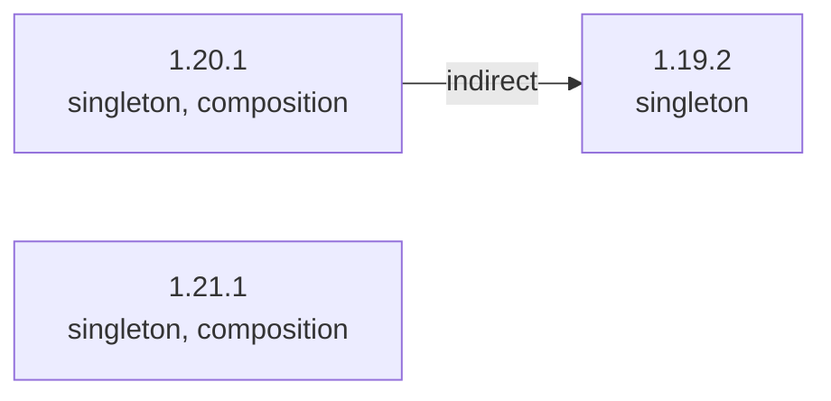

### 总概



```
1.21.1 (singleton)(composition)
1.20.1 (singleton)(composition)
 └── 1.19.2 (singleton)
```

### 传送区域

- [1.19.2](/projects/1.19/assets/chisel-chipped-integration/chisel_chipped_integration)
- [1.20.1](/projects/1.20/assets/chisel-chipped-integration/chisel_chipped_integration)
- [1.21.1](/projects/1.21/assets/chisel-chipped-integration/chisel_chipped_integration)