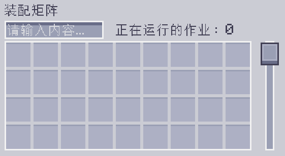

---
navigation:
    parent: epp_intro/epp_intro-index.md
    title: 装配矩阵
    icon: extendedae:assembler_matrix_frame
categories:
- extended devices
item_ids:
- extendedae:assembler_matrix_frame
- extendedae:assembler_matrix_wall
- extendedae:assembler_matrix_glass
- extendedae:assembler_matrix_pattern
- extendedae:assembler_matrix_crafter
- extendedae:assembler_matrix_speed
---

# 装配矩阵

<Row>
<BlockImage id="extendedae:assembler_matrix_frame" p:formed="true" p:powered="true" scale="5"></BlockImage>
<BlockImage id="extendedae:assembler_matrix_wall" scale="5"></BlockImage>
<BlockImage id="extendedae:assembler_matrix_glass" scale="5"></BlockImage>
</Row>
<Row>
<BlockImage id="extendedae:assembler_matrix_pattern" scale="5"></BlockImage>
<BlockImage id="extendedae:assembler_matrix_crafter" scale="5"></BlockImage>
<BlockImage id="extendedae:assembler_matrix_speed" scale="5"></BlockImage>
</Row>

装配矩阵是一个多方块结构，同时有<ItemLink id="ae2:molecular_assembler" />与<ItemLink id="ae2:pattern_provider" />的功能。它能同时进行大量的合成作业（ME网络中需有足量<ItemLink id="ae2:crafting_accelerator" />），还可节省频道。

## 结构

<GameScene zoom="3" background="transparent" interactive={true}>
  <ImportStructure src="../structure/assembler_matrix.snbt"></ImportStructure>
</GameScene>

其构造需为长方体，且各棱长在3到7之间。
- 棱应由装配矩阵框架组成。
- 面应由装配矩阵墙壁/玻璃组成。
- 内部应由装配矩阵样板/合成/速度核心组成。

装配矩阵必须包含至少一个样板核心和至少一个合成核心，结构内部不允许存在空洞。装配矩阵的搭建方式正确且有供能时，装配矩阵框架上的线会变为蓝色。

## 装配矩阵核心

装配矩阵核心共有3种变种。

- 装配矩阵样板核心

装配矩阵只会从其样板核心处取用样板，每个样板核心都有36个样板槽位供使用。

- 装配矩阵合成核心

装配矩阵会将收到的合成请求分配到其合成核心，每个合成核心都可同时进行8个合成作业。

- 装配矩阵速度核心

速度核心是装配矩阵的<ItemLink id="ae2:speed_card" />。5个速度核心可让装配矩阵全速运转。装入超出5个速度核心并不会提供更多速度加成。

## 界面

右击已构成且在线的装配矩阵可打开其界面。

界面中可放入和搜索样板，也可查看正在运行的合成作业的数量。
