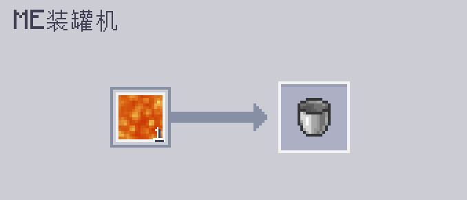

---
navigation:
    parent: epp_intro/epp_intro-index.md
    title: ME装罐器
    icon: extendedae:caner
categories:
- extended devices
item_ids:
- extendedae:caner
---

# ME装罐器

<BlockImage id="extendedae:caner" scale="8"></BlockImage>

ME装罐器是能将事物“装罐”的机器，从流体，到通用机械（Mekanism）的化学品，再到植物魔法（Botania）的魔力，甚至连能量都行！

第一个槽位是需要装填的事物，第二个槽位则是需被装填的事物。

装罐器需能量才会运作，每次操作需消耗80 AE。

默认情况下装罐器只会装填流体，需安装对应的附属才可装填其他事物。

### 支持的附属：
- 应用通量（Applied Flux）
- 应用能源：通用机械附属（Applied Mekanistics）
- 应用能源：植物魔法附属（Applied Botanics Addon）

## 使用ME装罐器自动合成

装罐器只有顶面和底面会接受供能，也只有这两个面会提供网络连接。

<GameScene zoom="6" background="transparent">
  <ImportStructure src="../structure/caner_example.snbt"></ImportStructure>
</GameScene>

如下是使用了ME装罐器的一个简单设施。若ME装罐器是从<ItemLink id="ae2:pattern_provider" />处获得的材料，则其会自动弹出产物。

<GameScene zoom="6" background="transparent">
  <ImportStructure src="../structure/caner_auto.snbt"></ImportStructure>
</GameScene>

所用的样板必须仅包含需装填的事物，以及需被装填的容器。示例见下：

填充水桶：

为能量板充能（需安装应用通量，Applied Flux）：

## 排空模式

ME装罐器也可在排空模式下清出容器中的事物。前文样板中的输入和输出需对调。
