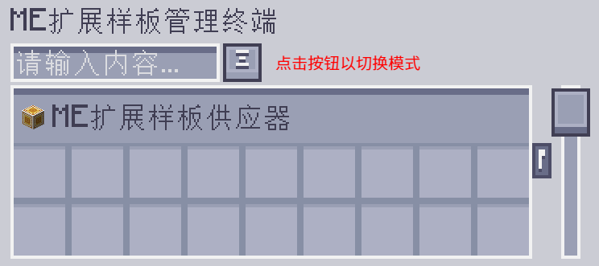
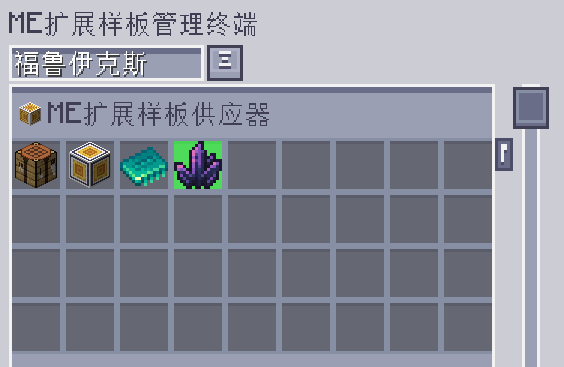
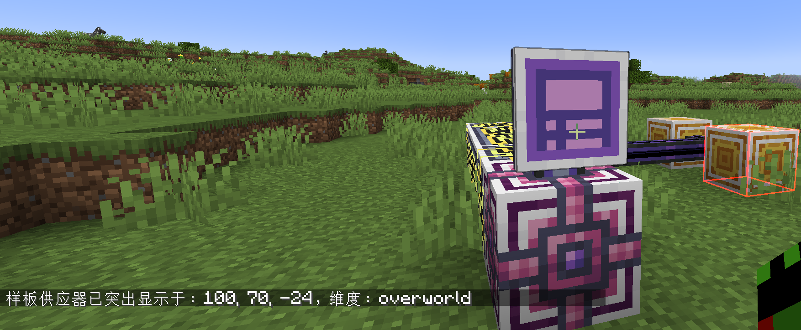

---
navigation:
    parent: epp_intro/epp_intro-index.md
    title: ME扩展样板管理终端
    icon: extendedae:ex_pattern_access_part
categories:
- extended devices
item_ids:
- extendedae:ex_pattern_access_part
- extendedae:wireless_ex_pat
---

# ME扩展样板管理终端

相比<ItemLink id="ae2:pattern_access_terminal" />而言，ME扩展样板管理终端新增了3种额外功能。

<Row gap="20">
<GameScene zoom="6" background="transparent">
<ImportStructure src="../structure/cable_ex_pattern_terminal.snbt"></ImportStructure>
<IsometricCamera yaw="180"></IsometricCamera>
</GameScene>
<ItemImage id="extendedae:wireless_ex_pat" scale="4"></ItemImage>
</Row>

## 更好的样板搜索

可按照输入与输出材料的名称搜索样板。

## 样板突出显示

有些时候，想找的样板可能还是很难找到，因为样板总是按组显示的。扩展样板管理终端可在界面中突出显示匹配的样板。

## 世界中样板供应器突出显示

进行大型合成作业时，排查卡住的样板供应器会是桩磨人的差事。扩展样板管理终端能突出显示世界中的样板供应器，以便定位。

