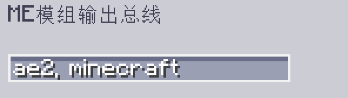

---
navigation:
    parent: epp_intro/epp_intro-index.md
    title: ME模组输出总线
    icon: extendedae:mod_export_bus
categories:
- extended devices
item_ids:
- extendedae:mod_export_bus
---

# ME模组输出总线

<GameScene zoom="8" background="transparent">
  <ImportStructure src="../structure/cable_mod_export_bus.snbt"></ImportStructure>
</GameScene>

ME模组输出总线的性质与<ItemLink id="ae2:export_bus" />相同，但可以按照模组名或模组ID进行过滤。

如需过滤多个模组，可用逗号分隔各模组的ID。

