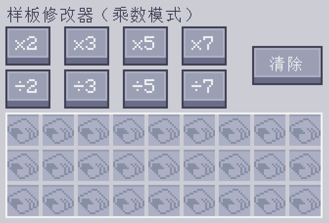
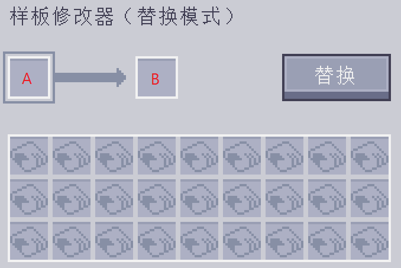
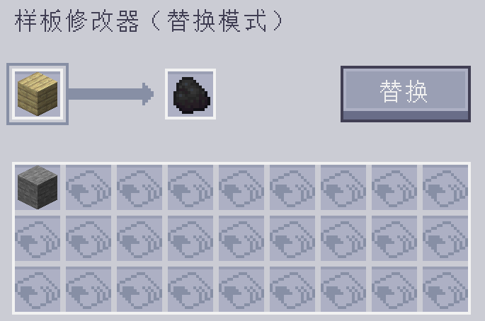
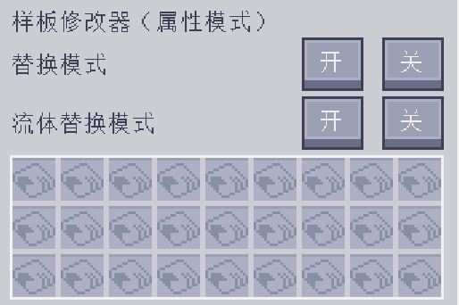
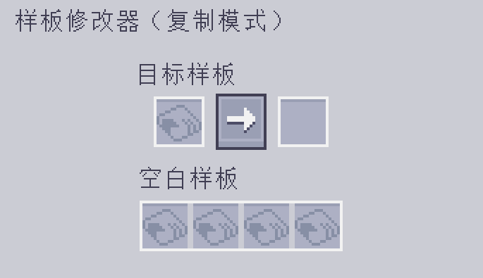

---
navigation:
    parent: epp_intro/epp_intro-index.md
    title: 样板修改器
    icon: extendedae:pattern_modifier
categories:
- extended items
item_ids:
- extendedae:pattern_modifier
---

# 样板修改器

样板修改器能批量修改样板。

<ItemImage id="extendedae:pattern_modifier" scale="4"></ItemImage>

手持右击可打开其界面。

## 乘数模式

此模式下，按下对应按钮即可将处理样本的输入与输出统一乘或除以某数、

原本的样板：

乘10之后：

也可按下“清除”按钮，以清空所有样板的配方，将它们变为空白样本。

### 注意事项

 - 除法按钮只在原数量可被整除时有效。比如，“÷2”按钮对需要输入3个圆石的样板无效，因为3除以2为1.5。

 - 乘法按钮有数量上限（999999）。单种材料的数量无法超过此值。

## 替换模式

将样板的某些输入和输出替换成其他物品。

槽位A是将被替换的事物，槽位B则是将要替换为的事物。

比如，下方的配置可将木板替换为煤炭。

点击“替换”按钮即可进行替换。

## 属性模式

修改合成样板的替换与流体替换模式。

## 复制模式

此模式下，可以将所给任意样板进行复制。

