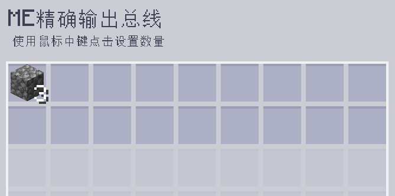
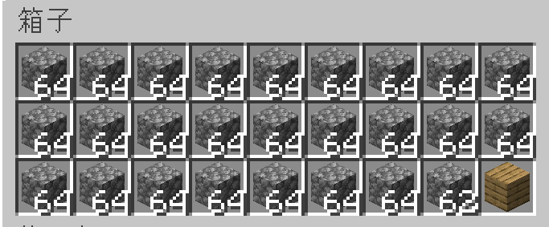

---
navigation:
    parent: epp_intro/epp_intro-index.md
    title: ME精确输出总线
    icon: extendedae:precise_export_bus
categories:
- extended devices
item_ids:
- extendedae:precise_export_bus
---

# ME精确输出总线

<GameScene zoom="8" background="transparent">
  <ImportStructure src="../structure/cable_precise_export_bus.snbt"></ImportStructure>
</GameScene>

ME精确输出总线能以规定的数量输出物品与流体。只有在目标容器能存下所有输出产物时，它才会进行输出。

## 示例

此例中每次操作输出3个圆石。网络中圆石的数量小于3即停止输出。

目标容器若无法容纳所输出的物品，则也会停止输出。此例中的箱子只能再装下2个圆石，输出总线便停止运作。
