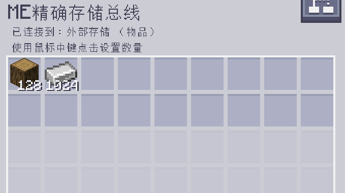

---
navigation:
    parent: epp_intro/epp_intro-index.md
    title: ME精确存储总线
    icon: extendedae:precise_storage_bus
categories:
- extended devices
item_ids:
- extendedae:precise_storage_bus
---

# ME精确存储总线

<GameScene zoom="8" background="transparent">
  <ImportStructure src="../structure/cable_precise_storage_bus.snbt"></ImportStructure>
</GameScene>

ME精确存储总线的性质与<ItemLink id="ae2:storage_bus" />相同，但可以按照数量进行过滤，且它只会向容器输出最多给定数量个物品。

