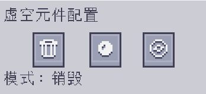

---
navigation:
    parent: epp_intro/epp_intro-index.md
    title: ME虚空元件
    icon: extendedae:void_cell
categories:
- extended items
item_ids:
- extendedae:void_cell
---

# ME虚空元件

能放到驱动器里的便携式聚合器。

<ItemImage id="extendedae:void_cell" scale="4"></ItemImage>

虚空元件使用前需在<ItemLink id="ae2:cell_workbench" />处分区。它会销毁所有匹配过滤的事物；或是像<ItemLink id="ae2:condenser" />那样，将它们聚合为<ItemLink id="ae2:matter_ball" />或<ItemLink id="ae2:singularity" />。

右击以打开其配置界面。

