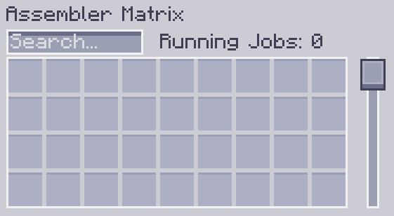

---
navigation:
    parent: epp_intro/epp_intro-index.md
    title: Assembler Matrix
    icon: extendedae:assembler_matrix_frame
categories:
- extended devices
item_ids:
- extendedae:assembler_matrix_frame
- extendedae:assembler_matrix_wall
- extendedae:assembler_matrix_glass
- extendedae:assembler_matrix_pattern
- extendedae:assembler_matrix_crafter
- extendedae:assembler_matrix_speed
---

# Assembler Matrix

<Row>
<BlockImage id="extendedae:assembler_matrix_frame" p:formed="true" p:powered="true" scale="5"></BlockImage>
<BlockImage id="extendedae:assembler_matrix_wall" scale="5"></BlockImage>
<BlockImage id="extendedae:assembler_matrix_glass" scale="5"></BlockImage>
</Row>
<Row>
<BlockImage id="extendedae:assembler_matrix_pattern" scale="5"></BlockImage>
<BlockImage id="extendedae:assembler_matrix_crafter" scale="5"></BlockImage>
<BlockImage id="extendedae:assembler_matrix_speed" scale="5"></BlockImage>
</Row>

Assembler Matrix is a multiblock structure. It is an combination of <ItemLink id="ae2:molecular_assembler" /> and <ItemLink id="ae2:pattern_provider" />.
It can run a lot of crafting jobs at the same (with enough <ItemLink id="ae2:crafting_accelerator" />s in your ME network) and save channels for you.

## Structure

<GameScene zoom="3" background="transparent" interactive={true}>
  <ImportStructure src="../structure/assembler_matrix.snbt"></ImportStructure>
</GameScene>

It is a rectangular prism, with edge lengths between 3 and 7. 
- Edges composed of Assembler Matrix Frame.
- Faces composed of Assembler Matrix Wall/Glass.
- Interior composed of Assembler Matrix Pattern/Craft/Speed Core.

A valid Assembler Matrix must contain at least one pattern core and craft core. 
It must be completely filled and can't be hollow.
When Assembler Matrix is correctly formed and powered, the lines on Assembler Matrix Frame will turn blue.

## Assembler Matrix Core

There are 3 different Assembler Matrix Cores.

- Assembler Matrix Pattern Core

Assembler Matrix only take patterns from its pattern core. Each pattern core provides 36 pattern slots for Assembler Matrix.

- Assembler Matrix Craft Core

Assembler Matrix will assign the received crafting jobs to its craft core. Each craft core can run 8 crafting jobs at the same time.

- Assembler Matrix Speed Core

It is the <ItemLink id="ae2:speed_card" /> for Assembler Matrix. 5 speed cores allow the Assembler Matrix to run at full speed.
Installing more than 5 speed cores won't give extra speed boost.

## GUI

Right-click on a formed and online Assembler Matrix will open it GUI.

You can put or search patterns in it, and view how many crafting jobs it is running.
