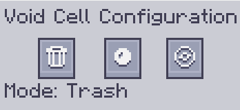

---
navigation:
    parent: epp_intro/epp_intro-index.md
    title: ME Void Cell
    icon: extendedae:void_cell
categories:
- extended items
item_ids:
- extendedae:void_cell
---

# ME Void Cell

A pocket condenser in the drive.

<ItemImage id="extendedae:void_cell" scale="4"></ItemImage>

Void cell needs to be partitioned on <ItemLink id="ae2:cell_workbench" /> before using. It will delete everything that
matches its filter or condense them into <ItemLink id="ae2:matter_ball" />s or <ItemLink id="ae2:singularity" />s like <ItemLink id="ae2:condenser" />.

Right click it to open configuration GUI.

