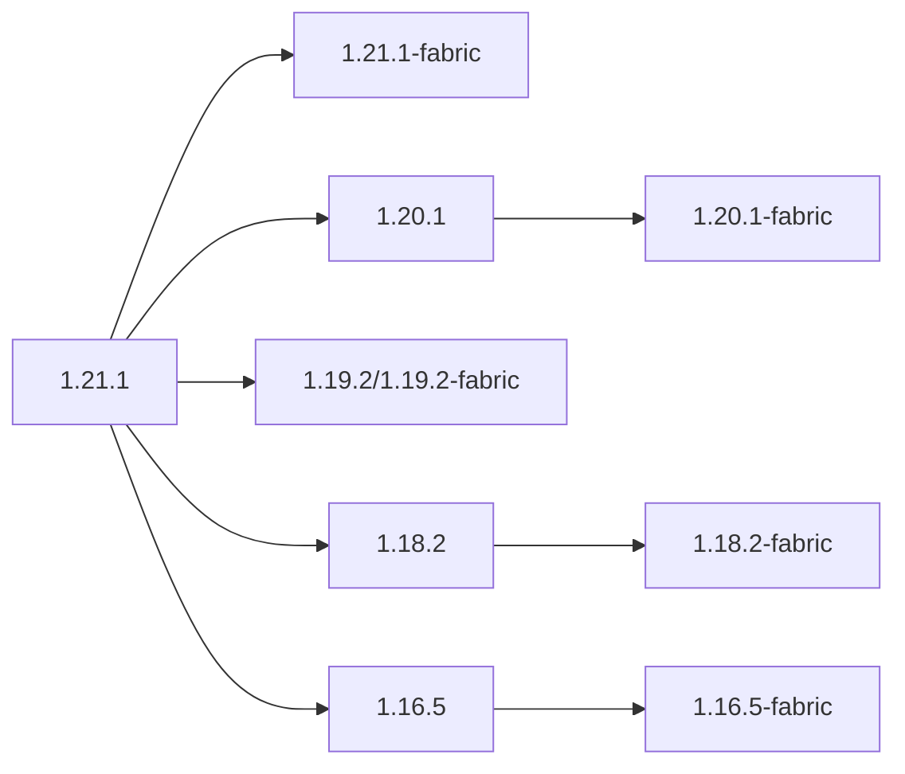

```mermaid
flowchart LR
    1.21.1 --> 1.21.1-fabric;
    1.20.1 --> 1.20.1-fabric;
    1.19.2/1.19.2-fabric;
    1.18.2 --> 1.18.2-fabric;
    1.16.5 --> 1.16.5-fabric;
    1.21.1 --> 1.20.1 & 1.19.2/1.19.2-fabric & 1.18.2 & 1.16.5
    click 1.21.1 "https://github.com"
    click 1.20.1 "https://github.com"
    click 1.18.2 "https://github.com"
    click 1.16.5 "https://github.com"
    click 1.21.1-fabric "https://github.com"
    click 1.20.1-fabric "https://github.com"
    click 1.19.2/1.19.2-fabric "https://github.com"
    click 1.18.2-fabric "https://github.com"
    click 1.16.5-fabric "https://github.com"
```