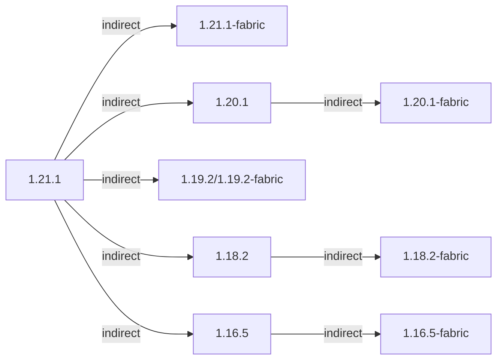

```mermaid
flowchart LR
    1.21.1 -->|indirect| 1.21.1-fabric;
    1.20.1 -->|indirect| 1.20.1-fabric;
    1.19.2/1.19.2-fabric;
    1.18.2 -->|indirect| 1.18.2-fabric;
    1.16.5 -->|indirect| 1.16.5-fabric;
    1.21.1 -->|indirect| 1.20.1 & 1.19.2/1.19.2-fabric & 1.18.2 & 1.16.5
    click 1.21.1 "https://github.com/CFPAOrg/Minecraft-Mod-Language-Package/tree/main-macaws/projects/1.21/assets/macaws-bridges/mcwbridges"
    click 1.20.1 "https://github.com/CFPAOrg/Minecraft-Mod-Language-Package/tree/main-macaws/projects/1.20/assets/macaws-bridges/mcwbridges"
    click 1.18.2 "https://github.com/CFPAOrg/Minecraft-Mod-Language-Package/tree/main-macaws/projects/1.18/assets/macaws-bridges/mcwbridges"
    click 1.16.5 "https://github.com/CFPAOrg/Minecraft-Mod-Language-Package/tree/main-macaws/projects/1.16/assets/macaws-bridges/mcwbridges"
    click 1.21.1-fabric "https://github.com/CFPAOrg/Minecraft-Mod-Language-Package/tree/main-macaws/projects/1.16-fabric/assets/macaws-bridges/mcwbridges"
    click 1.20.1-fabric "https://github.com/CFPAOrg/Minecraft-Mod-Language-Package/tree/main-macaws/projects/1.20-fabric/assets/macaws-bridges/mcwbridges"
    click 1.19.2/1.19.2-fabric "https://github.com/CFPAOrg/Minecraft-Mod-Language-Package/tree/main-macaws/projects/1.19/assets/macaws-bridges/mcwbridges"
    click 1.18.2-fabric "https://github.com/CFPAOrg/Minecraft-Mod-Language-Package/tree/main-macaws/projects/1.18-fabric/assets/macaws-bridges/mcwbridges"
    click 1.16.5-fabric "https://github.com/CFPAOrg/Minecraft-Mod-Language-Package/tree/main-macaws/projects/1.16-fabric/assets/macaws-bridges/mcwbridges"
```