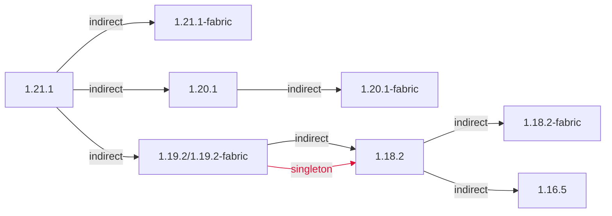

### 总概



```
1.21.1
 ├── 1.21.1-fabric
 ├── 1.20.1
 │    └── 1.20.1-fabric
 └── 1.19.2/1.19.2-fabric (singleton)
      ├── 1.18.2
      │    └── 1.18.2-fabric
      └── 1.16.5 (singleton)
```

### 链接区域

- [1.16.5](/projects/1.16/assets/macaws-furniture/mcwfurnitures)
- [1.18.2](/projects/1.18/assets/macaws-furniture/mcwfurnitures)
- [1.19.2](/projects/1.19/assets/macaws-furniture/mcwfurnitures)
- [1.20.1](/projects/1.20/assets/macaws-furniture/mcwfurnitures)
- [1.21.1](/projects/1.21/assets/macaws-furniture/mcwfurnitures)
- [1.18.2-fabric](/projects/1.18-fabric/assets/macaws-furniture/mcwfurnitures)
- [1.20.1-fabric](/projects/1.20-fabric/assets/macaws-furniture/mcwfurnitures)
- [1.21.1-fabric](/projects/1.21-fabric/assets/macaws-furniture/mcwfurnitures)