---
navigation:
  title: 大宗物品元件
  icon: bulk_item_cell
  parent: index.md
  position: 040
categories:
  - megacells
item_ids:
  - bulk_item_cell
  - bulk_cell_component
  - compression_card
  - decompression_module
---

# MEGA元件：大宗物品元件

我们现在开始介绍第一项MEGA专门定制的*专用*存储元件。事情开始有趣起来了。

## 大宗物品元件

<Row>
  <ItemImage id="bulk_cell_component" scale="3" />
  <ItemImage id="bulk_item_cell" scale="3" />
</Row>

**MEGA大宗物品元件**在许多方面上都和[传统的存储元件](ae2:items-blocks-machines/storage_cells.md)格格不入。

标准的元件通常可以容纳最多63种不同的物品，大宗元件则只能存储单种物品。单看这一点，这种元件可能没什么用，但大宗元件的第一项关键优势就在此显现：标准元件的各类型只能存储有限个物品，大宗元件则能存储**_无限_**个。对，确实是*无限*个，至少在使用环境下是这样。*（如果真的很好奇，可以看下方的“技术性事项”一节。）*

还有一件事需要注意，大宗元件无法用AE2和MEGA已有的元件外壳合成，而是要使用专门的下界合金外壳，每次都需自原材料和对应组件开始从头制作。正因此，大宗元件无法拆解为组件和外壳——不过也没有必要这么做就是了。

<Row>
  <RecipeFor id="bulk_cell_component" />
  <RecipeFor id="bulk_item_cell" />
</Row>

新制成的大宗元件无法直接使用；首先应为其*分区*（过滤），以指定它要接收的物品。可在<ItemLink id="ae2:cell_workbench" />中，以及本模组内便捷的<ItemLink id="portable_cell_workbench" />中进行此操作。经过分区的元件即会接收对应物品，甚至会优先于其他元件进行接收，乃至成为该物品的唯一目标位置。

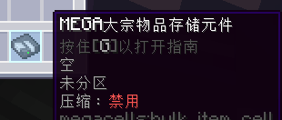
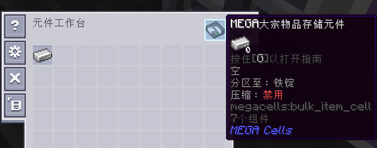
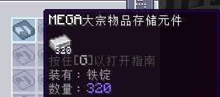

在元件开始接收和存储对应物品之后，只要过滤设置与已有的物品一致，即可和常规的元件一样存入取出。但如果这一过滤设置误遭清除或更改，元件就会出错，无法再接收新物品。不过，为方便紧急使用和恢复，元件中已有的物品依然可以取出；而且，一旦过滤设置恢复或元件被清空（新设置了非空过滤），元件即会恢复正常。

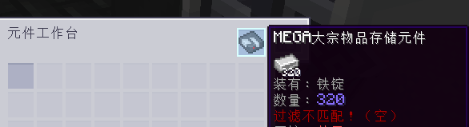
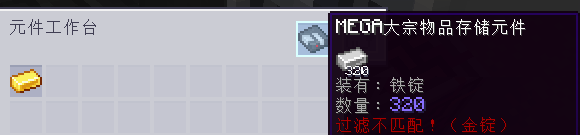

### 容量的技术性事项：

人们通常会认为Minecraft模组中所谓“无限容量”只是某种数量数据类型的最大值，比如Java中“整形”（int）的上限（约21.4亿），“长整型”（long）的上限（约920*京*，或9.2 \* 10^**18**），甚至是“双精度浮点数”（double）的上限（可达10的*308*次方，但因无法覆盖所有整数不适用于此情况）。

大宗元件则不使用这些原始类型，而是能存储任意大的数量，远超常人可理解的范围。即便任意ME网络对其中某一类物品的处理和显示上限均只是前文所提的920京个，从后台看来，大宗元件也依然可以超越这一限制，且可以表现出它超越了限制。

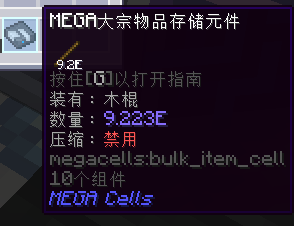
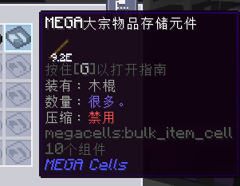

## 大宗压缩

<Row>
  <ItemImage id="compression_card" scale="3" />
</Row>

到目前为止，我们已经相对全面地介绍了大宗元件作为单种物品无底洞的功能。但是，玩家们都有此共识：在存储系统中，*金属锭*等部分物品应特殊对待。通常看来，铸锭等资源在存储和合成中会呈现为多种形态，例如存储时使用较大的“块”以缩减空间占用，以及合成时使用较小的“粒”等。这些不同的形态应当和对应的锭一同处理，但最基础的大宗元件却无法做到。

这时就要**_大宗压缩_**机制出马了。这种机制由**压缩卡**激活，它是专门为此给大宗元件设计的[升级卡](ae2:items-blocks-machines/upgrade_cards.md)。

<RecipeFor id="compression_card" />

借由此卡启用*压缩*功能之后，大宗元件即可识别并接收其分区物品的此类衍生物，还会自动将它们“压缩”为物质量最大的形态。这种自动压缩会参照相应变种的合成配方运作：如果某配方将一（1）个金属锭变成了九（9）个金属粒，同时还有配方反向将粒合成为锭，分区为该金属的大宗元件就能同时接收该金属的锭和粒，并会在可能时立即将存入的9个粒变为1个锭。

而且，这种自动压缩功能还会扩展到*所有*物质量更大的形态，比如金属块和部分模组中进一步“压缩”的产物。所有这些都视作一长串形态“链”统一管理。

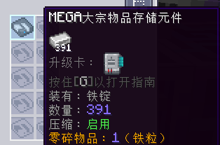

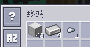
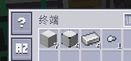

为让此机制正常运作，大宗元件在后台只会通过可合成的最小“单位”物品存储实际“数量”——通常是金属粒、宝石碎片、粉，或者其他类似物品。启用此机制的大宗元件会接收“链”中的所有物品，并在合适的情况下将它们转换成一定量的“单位”。甚至还可按照任意一种形态*取出*物品——无论是通过<ItemLink id="ae2:import_bus" />、<ItemLink id="ae2:export_bus" />等自动手段，还是在[终端](ae2:items-blocks-machines/terminals.md)中*Shift*点击取出。

如果有模组加入了某种资源的高阶“压缩”方块，此时可能需要限制自动压缩的上限，以更好地追踪该资源在某种形态下的数量；比如说，要按锭统计该资源的吞吐量时。为此目的，元件工作台内启用压缩的大宗元件可以循环切换其“压缩**截断**”设置，以此规定元件中资源的最大形态和自动压缩的停止位置。左击按钮会向最小形态循环切换，右击则向最大和最压缩形态。

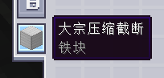
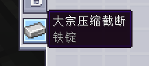

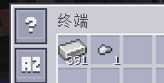

元件在启用压缩后，其“过滤不匹配”行为会稍微放松限制：元件会根据分区物品“记忆”它需管理的形态链；如果过滤配置误遭清除，还可使用对应链中的任意物品恢复，而非只可使用原本的物品。而且，如果向元件存入、从元件取出、与元件内替换所分区物品对应的小形态，元件还会存储和追踪“单位系数”——所配置的“形态”对应多少个“单位”——以便纠正错误，并在此类状况出现时进行相应更新。

如果还是遇到了最坏情况——无论（重新）为大宗元件设置何种分区，它都依然处于前文的“恢复”模式而无法恢复正常——元件中形态小于等于原有分区设置的物品也均可安全恢复。这是最后的兜底措施。

## 解压缩模块

<GameScene zoom="8" background="transparent">
  <ImportStructure src="assets/assemblies/decompression_module.snbt" />
  <IsometricCamera yaw="195" pitch="10" />
</GameScene>

到目前为止还不错。我们已经知道，无论是玩家自己操作还是经由<ItemLink id="ae2:import_bus" />和<ItemLink id="ae2:export_bus" />等设备，启用压缩的大宗元件都可以轻松处理任意形态的输入输出。但是，自动合成又该怎么办呢？

这一点就稍微有些复杂了。AE2中的[自动合成](ae2:ae2-mechanics/autocrafting.md)系统遵循“所见即所得”的假设。如果存储系统只回报称“有5个铁锭”，自动合成系统便会假定只有5个铁锭。如果没有[样板](ae2:ae2-mechanics/autocrafting.md#样板)可供制造更多铁锭，那么所有合成任务都最多只能取用5个，需要更多锭的任务都无法执行。问题就在于，假如某启用压缩的大宗元件恰巧设置为存储铁锭，且其截断位置高于铁锭，存储系统就有可能永远无法回报超过（通常来说是）8个铁锭，自动合成系统也因此无法执行步骤中要求更多锭的合成任务。

解决方法是**MEGA解压缩模块**线缆子部件。它相对来说功能不多，基本只用来扩展常规网络的自动合成系统及设施。

<RecipeFor id="decompression_module" />

网络中任意位置处有解压缩模块时，它即会持续搜索网络中启用压缩的大宗元件，并据此为各个元件生成出一系列的专用“伪样板”。这些样板会涵盖对应元件中形态链上的每一个物品，且它们完全在后台进行处理，不需要专门配备<ItemLink id="ae2:pattern_provider" />和<ItemLink id="ae2:molecular_assembler" />设施。这之后，自动合成系统便会如预期一般运转，按需“合成”更多物品，虽然技术上网络里原本就有这些物品。

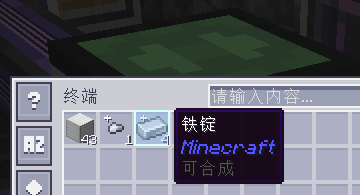

这些样板会遵守各大宗元件的截断设置；形态小于截断位置的物品对应的样板会使用大形态*拆分*出小形态，大于截断位置的则使用小形态合成为大形态。而无论合成的方向如何，模块均会为截断位置两侧的所有形态生成样板，以便执行需要对应物品的大型合成任务。

还可在模块内同时设置所有此类样板的“全局”[优先级](ae2:ae2-mechanics/autocrafting.md#优先级)。系统会综合考虑它和所有常规的自动合成基础设施——比如内有某形态对应样板的样板供应器。右击模块即可打开优先级菜单。

解压缩模块基本可以说是“无需维护”的设备，整个网络中通常只需一个模块就能启用所有相应的自动合成功能。**_但还是务必注意_**，模块的作用范围只在同网络，且只能追踪网络内ME箱子和ME驱动器中的元件。譬如说，它**_无法跨越_**[子网络](ae2:ae2-mechanics/subnetworks.md)。因此，搭建网络时应保证大宗存储集中于主网络，以便模块统一识别。
