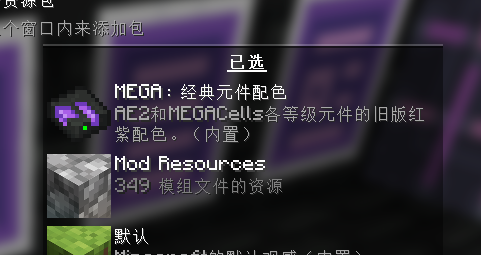

---
navigation:
  title: 附加
  icon: mega_interface
  parent: index.md
  position: 060
categories:
  - megacells
item_ids:
  - mega_interface
  - cell_dock
  - portable_cell_workbench
---

# MEGA元件：附加

在介绍过本附属的主要内容之后，为全面介绍也为方便实验，我们现在来总结MEGA中较为小型的额外特性和功能。

## MEGA接口

<Row>
  <BlockImage id="mega_interface" scale="4" />
  <GameScene zoom="4" background="transparent">
    <ImportStructure src="assets/assemblies/cable_mega_interface.snbt" />
  </GameScene>
</Row>

**MEGA接口**是<ItemLink id="megacells:mega_pattern_provider" />的补充，相当于容量翻倍的<ItemLink id="ae2:interface" />。槽位、输入输出、吞吐量、库存维持能力等，这些都是原本接口的两倍。

<RecipeFor id="mega_interface" />
<RecipeFor id="cable_mega_interface" />

## 便携元件工作台

<ItemImage id="portable_cell_workbench" scale="4" />

**便携元件工作台**和附属的其他内容相比有些不太合群，它只是个……*更小型*的<ItemLink id="ae2:cell_workbench" />。它的体积甚至小到一掌可握，但它依然能够和往常一样配置各式存储元件。

没人清楚一整台元件工作台是怎么塞得进这个物品的。

<RecipeFor id="portable_cell_workbench" />

## 元件坞

<GameScene zoom="8" background="transparent">
  <ImportStructure src="assets/assemblies/cell_dock.snbt" />
  <IsometricCamera yaw="195" pitch="30" />
</GameScene>

最后，还有一个设备同样是相较更小型而非更大型；也正因此它更加不合群，甚至都无法心安理得地称其为“MEGA”物品。

从某种方面看来，**ME元件坞**像是一个设计更紧凑的<ItemLink id="ae2:chest" />：同一时刻下它可容纳单个存储元件。虽然它缺失了ME箱子的部分额外功能——比如自带的终端，它也依然可用作小体积的存储空间。特别来说，因为它是“面板”形态的[线缆子部件](ae2:ae2-mechanics/cable-subparts.md)，所以单格内的单个线缆可安装多个元件坞。或许在紧凑的子网络需要某种暂时的缓存时，会有人用到它。

<RecipeFor id="cell_dock" />

## “经典元件配色”

作为可选的视觉效果回滚，MEGA提供了下述的资源包，供用户选用。

在Minecraft 1.21版本之前，AE2及其附属的发布版均为存储元件套组的纹理选用了一套5点配色方案：自1k的红棕色起始，经黄色、绿色、蓝色，最终在256k处变为淡紫罗兰色/薰衣草色。MEGA的各元件同样遵循了这一惯例，1M为深红色，至256M为较深的紫罗兰色。

AE2在1.20.x之后的版本大幅重绘了纹理，各存储元件的配色变化也更加精细。AE2基础存储元件的色调会随其等级增加而从蓝色变为绿色，MEGA则选择延续了这一变化：从黄色到红色再到粉红色。这种设计虽说也很不错，但保留旧版选项也是为顺应更喜欢原本配色方案的人的体验。

