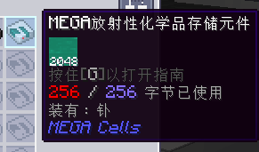

---
navigation:
  title: 放射性化学品元件（通用机械兼容限定）
  icon: radioactive_chemical_cell
  parent: index.md
  position: 050
categories:
  - megacells
item_ids:
  - radioactive_cell_component
  - radioactive_chemical_cell
---

# MEGA元件：放射性化学品元件

作为广泛兼容的一部分，MEGA为使用&zwnj;*通用机械（Mekanism）*&zwnj;和**_应用能源：通用机械附属（Applied Mekanistics）_**的玩家们添加了第二套专用的元件。而如果你没有安装这两者中的任意一个，下方的配方出了错，大可放心无视本页，假装这个元件不存在即可。

## 放射性化学品元件

<Row>
  <ItemImage id="radioactive_cell_component" scale="3" />
  <ItemImage id="radioactive_chemical_cell" scale="3" />
</Row>

**MEGA放射性化学品元件**物如其名，用于存储&zwnj;*通用机械（Mekanism）*&zwnj;的“化学品”；它是&zwnj;*应用能源：通用机械附属（Applied Mekanistics）*&zwnj;（及MEGA自身对其的兼容）中常规存储元件的补充。通常而言，使用常规的化学品元件时，各位会发现它们附带一条警告：它们不会存储任何*放射性*的化学品，在通用机械中一般指*核废料*、*钋*、*钚*。而放射性元件则自然*只会*存储上述化学品。

<Row>
  <RecipeFor id="radioactive_cell_component" />
  <RecipeFor id="radioactive_chemical_cell" />
</Row>

放射性元件和<ItemLink id="megacells:bulk_item_cell" />较为相似：它只能存储给定的单种放射性化学品，运作前也必须先分区。但两者的相似之处就只有这么多：放射性元件的存储量有限，最多为*256[字节](ae2:ae2-mechanics/bytes-and-types.md)*。不过就算这样，它的容量也相当于*2048桶*，或4个放射性废料桶，实际却只需占用一个元件的空间。

而为容纳和存储此类高能物质，元件的能耗会大幅上涨，以（天知道什么方法）将它们维持在相对稳定的状态。与<ItemLink id="ae2:item_storage_cell_1k" />的0.5 AE/t、<ItemLink id="ae2:item_storage_cell_256k" />的2.5 AE/t、<ItemLink id="megacells:item_storage_cell_256m" />的5 AE/t等常见能耗相比，单个放射性元件位于接入网络的ME箱子或ME驱动器时，会消耗足足**250 AE/t**。

最后，为鼓励通用机械的玩家们继续以原方法妥善处理核废料，放射性元件依旧明令禁止存储&zwnj;***用尽的*核废料**。*默认情况下*，想逃过监控裂变反应堆这一步没那么简单。而对那些仍希望使用简单方法的玩家来说，这一行为是可配置的。*如何*配置这一行为留给读者作为习题。
