---
navigation:
  title: Bulk Item Cell
  icon: bulk_item_cell
  parent: index.md
  position: 040
categories:
  - megacells
item_ids:
  - bulk_item_cell
  - bulk_cell_component
  - compression_card
  - decompression_module
---

# MEGA Cells: Bulk Item Cell

We now move onto the first of MEGA's bespoke *specialised* storage cells. This is where things get interesting.

## Bulk Item Cell

<Row>
  <ItemImage id="bulk_cell_component" scale="3" />
  <ItemImage id="bulk_item_cell" scale="3" />
</Row>

The **MEGA Bulk Item Cell** is, in many ways, a sort of antithesis to the
[conventional storage cell](ae2:items-blocks-machines/storage_cells.md).

While a standard cell is generally capable of holding up to 63 different types of items, the Bulk Cell is only capable
of storing a single type within itself. Now, in and of itself, this would make the cell rather pointless, but the Bulk
Cell does have one key advantage to start with: unlike the finite quantity of each item type on a standard cell, a Bulk
Cell is able to store an ***infinite*** amount of that single item type. And I do mean *infinite*, at least in a
practical sense. *(see the "Technical Bore" section a bit lower down if you're curious enough)*

Also worth noting is that the Bulk Cell is not craftable with any of the existing cell housings offered by either AE2 or
MEGA, instead opting for its own dedicated Netherite housing, always crafted from scratch together with its dedicated
component. For this reason, the Bulk Cell also cannot be disassembled back into its component and housing — though there
wouldn't be much point in doing so anyway.

<Row>
  <RecipeFor id="bulk_cell_component" />
  <RecipeFor id="bulk_item_cell" />
</Row>

A newly-crafted Bulk Cell cannot yet function; first it needs to be *partitioned* (filtered) to designate what item it
will store. This is done using a <ItemLink id="ae2:cell_workbench" /> or our convenient
<ItemLink id="portable_cell_workbench" />. Once this has been done, the cell will begin to take in that respective item,
even prioritising itself as the first and probably only place that this item will be sent to from the moment its filter
is set.

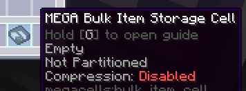
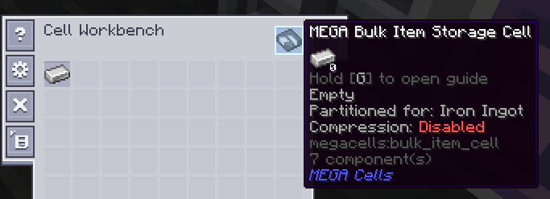
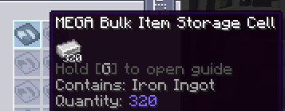

Once the cell has started to take in and store its respective item type, as long as the filter remains the same as the
item now already contained, it will continue to function and allow both further insertion and extraction just as a
regular cell would. Should this filter be accidentally either cleared or replaced, however, the cell will error out and
become unable to accept any new items. It will, however, allow for the extraction of its existing contents in case of
emergency and for the sake of recovery, and once either the original filter has been replaced or the cell has been
emptied (given a new non-empty filter), it will continue to function again as normal.

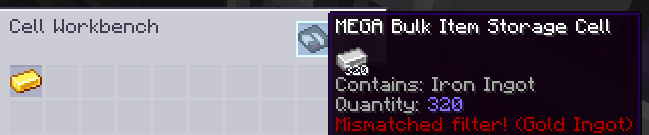

### The Technical Bore About Capacity:

One might commonly think of an "infinite capacity" in any given Minecraft mod as just being the maximum possible value
of a given type of numerical data, such as the limit within Java for an "int" (around 2.14 billion), a "long" (around
9.2 *quintillion*, or 9.2 \* 10^**18**) or even a "double" (which already reaches *308* orders of magnitude, though it
wouldn't be suitable here at all for working with whole-number quantities).

The Bulk Cell casts all of these primitive types by the wayside, and is instead designed in such a way to hold any
arbitrarily large quantity a user could reasonably conceive. Indeed, even though any given ME network will only ever be
able to handle and display up to the aforementioned 9.2 quintillion of any given item type stored within it, the Bulk
Cell is internally capable of going beyond this limit, and at the very least alluding to the fact that it may have done
so.

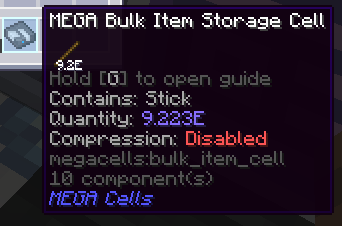
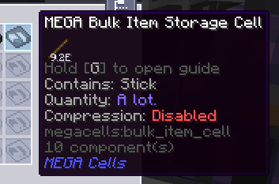

## Bulk Compression

<Row>
  <ItemImage id="compression_card" scale="3" />
</Row>

So far, we've done a good job of covering how a bulk cell works as an effectively bottomless pit for any one arbitrary
item type. However, it is widely understood among most players that some item types — namely, resources such as *metal
ingots* — have to be treated a bit differently for storage purposes. Very often, such resources like ingots will take
multiple forms for storage and crafting purposes, such as their larger "block" counterparts for the former to minimise
space and their smaller "nugget" form for the latter. While these are usually better off handled together with their
respective ingot in some way, a Bulk Cell, in its bog-standard form, would not easily cope with this expectation.

This is where the ***Bulk Compression*** mechanic comes in thanks to the **Compression Card**, a unique
[upgrade card](ae2:items-blocks-machines/upgrade_cards.md) exclusive to the Bulk Cell for this purpose.

<RecipeFor id="compression_card" />

With *Compression* enabled through this card, a Bulk Cell can be made aware of such variant forms of the resource being
kept track of, in order to equally accept these variants and automatically "compress" them as they enter into their next
highest variant. This automatic compression works according to the crafting recipes associated with these variants: if
one of these recipes turned something such as one (1) metal ingot into nine (9) nuggets of that metal and another
recipe turned those nine nuggets back into the one original ingot, a Bulk Cell configured to store that metal would be
able to accept both the ingot and nugget form of that metal, turning every 9 nuggets inserted into another ingot on the
fly.

Furthermore, this automatic compression extends to *all* higher variants, such as metal blocks and even more heavily
"compressed" versions of those blocks provided by such mods, altogether handled as one long "chain" of variants
from smallest to largest.

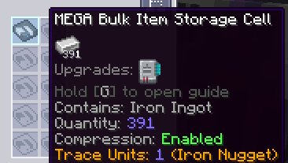

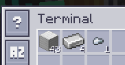

In order for this mechanic to work, a Bulk Cell internally only keeps track of its actual "quantity" as the amount of
the smallest possible "unit" item that the resource can be crafted down into — typically either a metal nugget, a gem
shard, a dust or some other equivalent. Along the wider chain mentioned earlier, a Bulk Cell with this mechanic enabled
will happily accept any and all of these variants both higher and lower, converting them into some amount of "units"
where applicable, and even allow for any one of these to be *extracted* through either automated means — such as the
<ItemLink id="ae2:import_bus" /> and <ItemLink id="ae2:export_bus" /> — or even a
[terminal](ae2:items-blocks-machines/terminals.md) (when *Shift*-clicking to extract).

In the case where a mod may be present adding far greater "compressed" block versions of a resource, it may be desirable
to limit just how high a resource can go with auto-compression to be able to more easily track the amount of that
resource in a specific form, e.g. when looking at the throughput of that resource in ingot form. For this purpose, a
Compression-enabled Bulk Cell still inside a Cell Workbench will allow for its "compression **cutoff**" to be cycled
through, dictating the highest variant that the cell should be able to accumulate in storage and at which the
auto-compression should stop. Left-clicking this button cycles the cutoff down towards the smallest unit item, while
right-clicking cycles backwards towards higher and higher compressed variants.

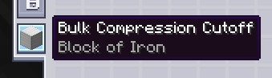
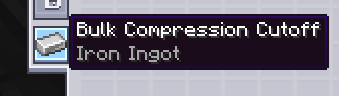

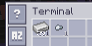

When Compression is enabled on a cell, the "filter mismatch" behaviour becomes a bit more lenient: the cell effectively
"remembers" what chain it needs to work with based on the item it has already been made to store, and if its filter is
accidentally removed somehow, it can be replaced with any of the associated variants rather than the specific variant
previously used as a filter. Furthermore, for the purposes of error correction in the event that some variant smaller
than the item configured onto the cell is added, removed or replaced, the current "unit factor" — i.e. how many "units"
will fit in total into one instance of the configured "variant" item — is also stored and tracked, updating accordingly
when the overall chain for these variants sees such a change.

As a last resort, if in some worst-case scenario a bulk cell is totally bricked regardless of the filter (re-)applied to
it and enters the aforementioned "recovery" mode, any smaller trace variants will be able to be recovered alongside the
base item the cell was initially partitioned to.

## Decompression Module

<GameScene zoom="8" background="transparent">
  <ImportStructure src="assets/assemblies/decompression_module.snbt" />
  <IsometricCamera yaw="195" pitch="10" />
</GameScene>

So far, so good. We know that with Compression enabled, a Bulk Cell can easily work with any corresponding variants when
inserted or extracted either by a player or devices like the <ItemLink id="ae2:import_bus" /> and
<ItemLink id="ae2:export_bus" />. Now, what about auto-crafting?

This one is a bit more complicated. In AE2, the [auto-crafting](ae2:ae2-mechanics/autocrafting.md) system relies on the
assumption that "what you see is what you get". If the storage system only reports, for example, 5 iron ingots, then the
crafting system will assume that, without a [pattern](ae2:ae2-mechanics/autocrafting.md#patterns) there to tell it how
to make more iron ingots, it will only have those 5 to work with for a given crafting job and be unable to carry it out
if more ingots are required. The problem arises, then, that with Compression set up for a Bulk Cell that happens to be
storing iron ingots, the storage system may well never report any more than (typically) 8 ingots at any given moment if
the cell is set to a higher cutoff, leaving the crafting system unable to work with any job which may eventually require
more iron ingots to fulfil a previous step.

The solution to this problem comes in the form of the **MEGA Decompression Module**, a relatively plain cable part that
serves almost as an extension to a regular network's auto-crafting system and facilities.

<RecipeFor id="decompression_module" />

When a Decompression Module is placed anywhere on the network, it will continuously scan the network for any connected
Compression-enabled Bulk Cells and automatically generate a set of specialised "fake patterns" for every such cell it
finds, covering every item in the variant chain corresponding to that cell. These patterns are then handled completely
internally, without the need for any dedicated <ItemLink id="ae2:pattern_provider" /> or
<ItemLink id="ae2:molecular_assembler" /> set-ups, allowing the crafting system to continue operating as normal by
"crafting" more of an item that is technically already being stored anyway.

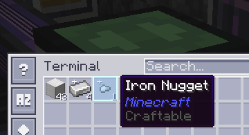

These patterns respond accordingly to the cutoff set on an individual Bulk Cell; patterns generated for variants smaller
than the cutoff item take their previous higher variant to be crafted *down* into several of those smaller variants,
while patterns generated for larger variants take several of the previous smaller variant to be crafted up. Whichever
direction is taken for these patterns, however, every variant on either side of the cutoff point is still automatically
accounted for in case a larger crafting job requires them.

The module also allows for a "global" [priority](ae2:ae2-mechanics/autocrafting.md#priority) to be set for all these
patterns together, relative to any regular crafting infrastructure such as Pattern Providers with their own patterns for
a given variant item, by right-clicking on the module to open the priority menu.

The Decompression Module is very much a "set it and forget it" device, and you typically only need one module on a given
network for all of its auto-crafting functionality to be enabled. ***KEEP IN MIND, HOWEVER***, that the module only
functions on a same-network basis and can only keep track of any cells hooked up to ME Chests and Drives on the same
main network as itself. It ***WILL NOT WORK*** across [subnetworks](ae2:ae2-mechanics/subnetworks.md), for example, so you should ensure that your
Bulk storage remains centralised within your main network for the module to recognise it all.
