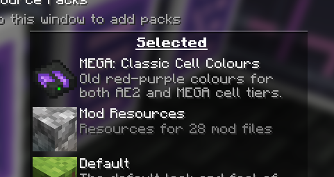

---
navigation:
  title: Extras
  icon: mega_interface
  parent: index.md
  position: 060
categories:
  - megacells
item_ids:
  - mega_interface
  - cell_dock
  - portable_cell_workbench
---

# MEGA Cells: Extras

With the main premise of the add-on addressed, we now conclude with some of the smaller extra features and additions
provided by MEGA for the sake of both completeness and a bit more experimentation.

## MEGA Interface

<Row>
  <BlockImage id="mega_interface" scale="4" />
  <GameScene zoom="4" background="transparent">
    <ImportStructure src="assets/assemblies/cable_mega_interface.snbt" />
  </GameScene>
</Row>

As a complement to the <ItemLink id="megacells:mega_pattern_provider" />, the **MEGA Interface** serves as a
double-capacity version of the <ItemLink id="ae2:interface" />. Twice the slots, twice the I/O and throughput, and twice
the stock-keeping.

<RecipeFor id="mega_interface" />
<RecipeFor id="cable_mega_interface" />

## Portable Cell Workbench

<ItemImage id="portable_cell_workbench" scale="4" />

Somewhat out of character for the rest of the add-on, the **Portable Cell Workbench** is a... *smaller* version of
the <ItemLink id="ae2:cell_workbench" />. Small enough, in fact, to fit just in the palm of your hand, while still
capable of configuring any storage cell as normal.

One can only wonder how a whole workbench could have fit into this thing.

<RecipeFor id="portable_cell_workbench" />

## Cell Dock

<GameScene zoom="8" background="transparent">
  <ImportStructure src="assets/assemblies/cell_dock.snbt" />
  <IsometricCamera yaw="195" pitch="30" />
</GameScene>

Finally, we have something else that's once again smaller rather than larger, which is why it seemed more out-of-place
than anything to call it a "MEGA" item.

The **ME Cell Dock** is, in some ways, like a more compact version of the <ItemLink id="ae2:chest" />, able to hold
within itself one storage cell at a time. While it may lack  some of the extra functionality of the Chest — namely, its
built-in terminal — it still makes for a fine compact storage provider. In particular, since it comes in the form of a
"flat" [cable part](ae2:ae2-mechanics/cable-subparts.md), a single cable can hold multiple Cell Docks within the same
one-block space. Perhaps one may find it useful in the case of a compact subnetwork requiring some kind of temporary
buffer storage.

<RecipeFor id="cell_dock" />

## "Classic Cell Colours"

As an optional visual throwback, MEGA provides the following bundled resource pack which the user may choose to enable.

In releases of both AE2 and its add-ons prior to Minecraft 1.21, the old textures for any sets of storage cells followed
a 5-point colour scheme, starting from a reddish brown for 1k cells and shifting through yellow, green and blue towards
a final light violet/lavender hue for 256k. MEGA also followed this trend with its own cell tiers, starting from a deep
red at 1M and ending with a deeper violet at 256M.

With the wider texture overhaul introduced in AE2 post-1.20.x, storage cells were also adapted to follow a somewhat
wider colour palette, with AE2's base storage cells following a blue-to-green hue shift along its tier progression and
MEGA intending to continue the progression from yellow to red to pink. While this is also quite nice, it didn't seem
like a bad idea to also include the option for the old colouring system for those who may have preferred it over the
current one.

