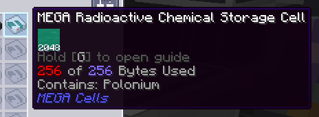

---
navigation:
  title: Radioactive Chemical Cell (AppMek-exclusive)
  icon: radioactive_chemical_cell
  parent: index.md
  position: 050
categories:
  - megacells
item_ids:
  - radioactive_cell_component
  - radioactive_chemical_cell
---

# MEGA Cells: Radioactive Chemical Cell

As part of its wider cross-add-on integration, MEGA features a second specialised cell exclusive to players also using
*Mekanism* and the ***Applied Mekanistics*** add-on. If you're not using either of these and the recipes below are
errored out instead, you can safely ignore this page and pretend this cell doesn't exist.

## Radioactive Chemical Cell

<Row>
  <ItemImage id="radioactive_cell_component" scale="3" />
  <ItemImage id="radioactive_chemical_cell" scale="3" />
</Row>

The **MEGA Radioactive Chemical Cell**, as the name would imply, serves as a complement to the regular storage cells
offered by *Applied Mekanistics* (and MEGA's own integration with this) to store *Mekanism*'s "chemicals". Normally,
when using the regular chemical cells, one might have noticed that these come with a caveat: they will not store any
chemical that is *radioactive*, which in Mekanism itself chiefly includes *Nuclear Waste*, *Polonium* and *Plutonium*.
The Radioactive Cell, of course, stores nothing *but* the aforementioned chemicals.

<Row>
  <RecipeFor id="radioactive_cell_component" />
  <RecipeFor id="radioactive_chemical_cell" />
</Row>

The Radioactive Cell is not too dissimilar to the <ItemLink id="megacells:bulk_item_cell" /> in that it can only store
one given type of radioactive chemical and it must be partitioned before it can operate. This where the similarities end
between the two, however; the Radioactive Cell only stores a finite amount of this chemical, at a maximum of *256
[bytes](ae2:ae2-mechanics/bytes-and-types.md)*. That is, however, the equivalent of *2048 buckets* — or 4 Nuclear Waste
Barrels' worth of this radioactive chemical — in the space of a single cell.

In order to contain and store such volatile substances, the cell does require a good amount more energy to (somehow!)
keep these in a relatively stable state. Compared to the typical power draw of 0.5 AE/tick for the
<ItemLink id="ae2:item_storage_cell_1k" />, 2.5 AE/t for the <ItemLink id="ae2:item_storage_cell_256k" /> and 5 AE/t
for the <ItemLink id="megacells:item_storage_cell_256m" />, one Radioactive Cell draws a whopping **250 AE/tick** while
within a connected ME Chest/Drive.

Lastly, to encourage Mekanism players to continue properly managing their nuclear waste as intended, the Radioactive
Cell still explicitly disallows ***Spent** Nuclear Waste* from being stored within it. *By default*, you're not getting
off the hook that easily in keeping your nuclear reactor stations in check. For players who still just want to take the
easy way out, however, this behaviour is configurable. *How* this behaviour is configured is left as an exercise for the
reader.
