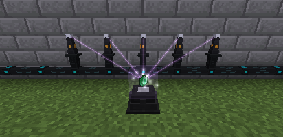

---
navigation:
  title: Energizing
  parent: energy_blocks/index.md
  icon: powah:energizing_orb
  position: 0
item_ids:
  - powah:energizing_orb
  - powah:energizing_rod_basic
  - powah:energizing_rod_blazing
  - powah:energizing_rod_hardened
  - powah:energizing_rod_niotic
  - powah:energizing_rod_nitro
  - powah:energizing_rod_spirited
  - powah:energizing_rod_starter
---

# Energizing

The Energizing Orb its a block used to energize items, require at least one Energizing Rod in range of 9X9 to work, the energizing speed depends on amount of rods and the rod tier (I/O rate). 

The orb does not require energy but the rods must be placed on cables or any Forge Energy (FE) block to work. 

<Row>
<RecipesFor id="powah:energizing_orb" />
</Row>
|                                                 | Capacity                                                    | Max I/O                                                  |
| ----------------------------------------------- | ----------------------------------------------------------- | -------------------------------------------------------- |
| <ItemLink id="powah:energizing_rod_starter" />  | <powah:EnergyCapacity id="powah:energizing_rod_starter" />  | <powah:EnergyMaxIO id="powah:energizing_rod_starter" />  |
| <ItemLink id="powah:energizing_rod_basic" />    | <powah:EnergyCapacity id="powah:energizing_rod_basic" />    | <powah:EnergyMaxIO id="powah:energizing_rod_basic" />    |
| <ItemLink id="powah:energizing_rod_hardened" /> | <powah:EnergyCapacity id="powah:energizing_rod_hardened" /> | <powah:EnergyMaxIO id="powah:energizing_rod_hardened" /> |
| <ItemLink id="powah:energizing_rod_blazing" />  | <powah:EnergyCapacity id="powah:energizing_rod_blazing" />  | <powah:EnergyMaxIO id="powah:energizing_rod_blazing" />  |
| <ItemLink id="powah:energizing_rod_niotic" />   | <powah:EnergyCapacity id="powah:energizing_rod_niotic" />   | <powah:EnergyMaxIO id="powah:energizing_rod_niotic" />   |
| <ItemLink id="powah:energizing_rod_spirited" /> | <powah:EnergyCapacity id="powah:energizing_rod_spirited" /> | <powah:EnergyMaxIO id="powah:energizing_rod_spirited" /> |
| <ItemLink id="powah:energizing_rod_nitro" />    | <powah:EnergyCapacity id="powah:energizing_rod_nitro" />    | <powah:EnergyMaxIO id="powah:energizing_rod_nitro" />    |

<Row>
<RecipesFor id="powah:energizing_rod_starter" />
<RecipesFor id="powah:energizing_rod_basic" />
<RecipesFor id="powah:energizing_rod_hardened" />
<RecipesFor id="powah:energizing_rod_blazing" />
<RecipesFor id="powah:energizing_rod_niotic" />
<RecipesFor id="powah:energizing_rod_spirited" />
<RecipesFor id="powah:energizing_rod_nitro" />
</Row>