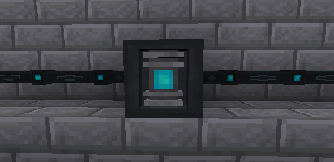

---
navigation:
  title: Energy Discharger
  parent: energy_blocks/index.md
  icon: powah:energy_discharger_starter
  position: 3
item_ids:
  - powah:energy_discharger_basic
  - powah:energy_discharger_blazing
  - powah:energy_discharger_hardened
  - powah:energy_discharger_niotic
  - powah:energy_discharger_nitro
  - powah:energy_discharger_spirited
  - powah:energy_discharger_starter
---

# Energy Discharger

The Energy Discharger its a block used to drain energy (FE) out of charged items and then store it to an internal buffer if then connected via cables to extract that stored power and re-using it again. 

|                                                    | Capacity                                                       | Max I/O                                                     |
| -------------------------------------------------- | -------------------------------------------------------------- | ----------------------------------------------------------- |
| <ItemLink id="powah:energy_discharger_starter" />  | <powah:EnergyCapacity id="powah:energy_discharger_starter" />  | <powah:EnergyMaxIO id="powah:energy_discharger_starter" />  |
| <ItemLink id="powah:energy_discharger_basic" />    | <powah:EnergyCapacity id="powah:energy_discharger_basic" />    | <powah:EnergyMaxIO id="powah:energy_discharger_basic" />    |
| <ItemLink id="powah:energy_discharger_hardened" /> | <powah:EnergyCapacity id="powah:energy_discharger_hardened" /> | <powah:EnergyMaxIO id="powah:energy_discharger_hardened" /> |
| <ItemLink id="powah:energy_discharger_blazing" />  | <powah:EnergyCapacity id="powah:energy_discharger_blazing" />  | <powah:EnergyMaxIO id="powah:energy_discharger_blazing" />  |
| <ItemLink id="powah:energy_discharger_niotic" />   | <powah:EnergyCapacity id="powah:energy_discharger_niotic" />   | <powah:EnergyMaxIO id="powah:energy_discharger_niotic" />   |
| <ItemLink id="powah:energy_discharger_spirited" /> | <powah:EnergyCapacity id="powah:energy_discharger_spirited" /> | <powah:EnergyMaxIO id="powah:energy_discharger_spirited" /> |
| <ItemLink id="powah:energy_discharger_nitro" />    | <powah:EnergyCapacity id="powah:energy_discharger_nitro" />    | <powah:EnergyMaxIO id="powah:energy_discharger_nitro" />    |

<Row>
<RecipesFor id="powah:energy_discharger_starter" />
<RecipesFor id="powah:energy_discharger_basic" />
<RecipesFor id="powah:energy_discharger_hardened" />
<RecipesFor id="powah:energy_discharger_blazing" />
<RecipesFor id="powah:energy_discharger_niotic" />
<RecipesFor id="powah:energy_discharger_spirited" />
<RecipesFor id="powah:energy_discharger_nitro" />
</Row>