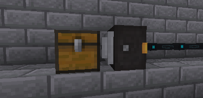

---
navigation:
  title: Energy Hopper
  parent: energy_blocks/index.md
  icon: powah:energy_hopper_starter
  position: 2
item_ids:
  - powah:energy_hopper_basic
  - powah:energy_hopper_blazing
  - powah:energy_hopper_hardened
  - powah:energy_hopper_niotic
  - powah:energy_hopper_nitro
  - powah:energy_hopper_spirited
  - powah:energy_hopper_starter
---

# Energy Hopper

The Energy Hopper its a block used to charge chargeable items inside an adjacent inventory like a chest or any block with an accessible inventory and not a not has forge energy. 

|                                                | Capacity                                                   | Max I/O                                                 |
| ---------------------------------------------- | ---------------------------------------------------------- | ------------------------------------------------------- |
| <ItemLink id="powah:energy_hopper_starter" />  | <powah:EnergyCapacity id="powah:energy_hopper_starter" />  | <powah:EnergyMaxIO id="powah:energy_hopper_starter" />  |
| <ItemLink id="powah:energy_hopper_basic" />    | <powah:EnergyCapacity id="powah:energy_hopper_basic" />    | <powah:EnergyMaxIO id="powah:energy_hopper_basic" />    |
| <ItemLink id="powah:energy_hopper_hardened" /> | <powah:EnergyCapacity id="powah:energy_hopper_hardened" /> | <powah:EnergyMaxIO id="powah:energy_hopper_hardened" /> |
| <ItemLink id="powah:energy_hopper_blazing" />  | <powah:EnergyCapacity id="powah:energy_hopper_blazing" />  | <powah:EnergyMaxIO id="powah:energy_hopper_blazing" />  |
| <ItemLink id="powah:energy_hopper_niotic" />   | <powah:EnergyCapacity id="powah:energy_hopper_niotic" />   | <powah:EnergyMaxIO id="powah:energy_hopper_niotic" />   |
| <ItemLink id="powah:energy_hopper_spirited" /> | <powah:EnergyCapacity id="powah:energy_hopper_spirited" /> | <powah:EnergyMaxIO id="powah:energy_hopper_spirited" /> |
| <ItemLink id="powah:energy_hopper_nitro" />    | <powah:EnergyCapacity id="powah:energy_hopper_nitro" />    | <powah:EnergyMaxIO id="powah:energy_hopper_nitro" />    |

<Row>
<RecipesFor id="powah:energy_hopper_starter" />
<RecipesFor id="powah:energy_hopper_basic" />
<RecipesFor id="powah:energy_hopper_hardened" />
<RecipesFor id="powah:energy_hopper_blazing" />
<RecipesFor id="powah:energy_hopper_niotic" />
<RecipesFor id="powah:energy_hopper_spirited" />
<RecipesFor id="powah:energy_hopper_nitro" />
</Row>