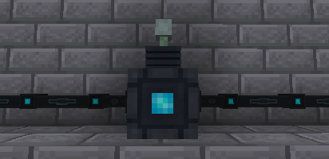

---
navigation:
  title: Player Transmitter
  parent: energy_blocks/index.md
  icon: powah:player_transmitter_starter
  position: 1
item_ids:
  - powah:player_transmitter_basic
  - powah:player_transmitter_blazing
  - powah:player_transmitter_hardened
  - powah:player_transmitter_niotic
  - powah:player_transmitter_nitro
  - powah:player_transmitter_spirited
  - powah:player_transmitter_starter
---

# Player Transmitter

The Player Transmitter its a block used to charge items wirelessly in linked player inventory including armor slots and off-hand anywhere in the same dimension when has a normal binding card and across dimensions when has a dimensional binding card. 

|                                                     | Capacity                                                        | Max I/O                                                      |
| --------------------------------------------------- | --------------------------------------------------------------- | ------------------------------------------------------------ |
| <ItemLink id="powah:player_transmitter_starter" />  | <powah:EnergyCapacity id="powah:player_transmitter_starter" />  | <powah:EnergyMaxIO id="powah:player_transmitter_starter" />  |
| <ItemLink id="powah:player_transmitter_basic" />    | <powah:EnergyCapacity id="powah:player_transmitter_basic" />    | <powah:EnergyMaxIO id="powah:player_transmitter_basic" />    |
| <ItemLink id="powah:player_transmitter_hardened" /> | <powah:EnergyCapacity id="powah:player_transmitter_hardened" /> | <powah:EnergyMaxIO id="powah:player_transmitter_hardened" /> |
| <ItemLink id="powah:player_transmitter_blazing" />  | <powah:EnergyCapacity id="powah:player_transmitter_blazing" />  | <powah:EnergyMaxIO id="powah:player_transmitter_blazing" />  |
| <ItemLink id="powah:player_transmitter_niotic" />   | <powah:EnergyCapacity id="powah:player_transmitter_niotic" />   | <powah:EnergyMaxIO id="powah:player_transmitter_niotic" />   |
| <ItemLink id="powah:player_transmitter_spirited" /> | <powah:EnergyCapacity id="powah:player_transmitter_spirited" /> | <powah:EnergyMaxIO id="powah:player_transmitter_spirited" /> |
| <ItemLink id="powah:player_transmitter_nitro" />    | <powah:EnergyCapacity id="powah:player_transmitter_nitro" />    | <powah:EnergyMaxIO id="powah:player_transmitter_nitro" />    |

<Row>
<RecipesFor id="powah:player_transmitter_starter" />
<RecipesFor id="powah:player_transmitter_basic" />
<RecipesFor id="powah:player_transmitter_hardened" />
<RecipesFor id="powah:player_transmitter_blazing" />
<RecipesFor id="powah:player_transmitter_niotic" />
<RecipesFor id="powah:player_transmitter_spirited" />
<RecipesFor id="powah:player_transmitter_nitro" />
</Row>