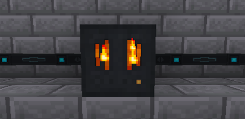

---
navigation:
  title: Furnator
  parent: generators/index.md
  icon: powah:furnator_starter
  position: 0
item_ids:
  - powah:furnator_basic
  - powah:furnator_blazing
  - powah:furnator_hardened
  - powah:furnator_niotic
  - powah:furnator_nitro
  - powah:furnator_spirited
  - powah:furnator_starter
---

# Furnator

The Furnator is an FE generator that generates energy from solid Furnace fuel like coal, wood ... 

High tiers generate more FE/t and it has higher energy output, also they burn the fuel faster with the same energy gained per fuel tick. 

|                                           | Capacity                                              | Generates                                               | Max Extract                                        |
| ----------------------------------------- | ----------------------------------------------------- | ------------------------------------------------------- | -------------------------------------------------- |
| <ItemLink id="powah:furnator_starter" />  | <powah:EnergyCapacity id="powah:furnator_starter" />  | <powah:EnergyGeneration id="powah:furnator_starter" />  | <powah:EnergyMaxIO id="powah:furnator_starter" />  |
| <ItemLink id="powah:furnator_basic" />    | <powah:EnergyCapacity id="powah:furnator_basic" />    | <powah:EnergyGeneration id="powah:furnator_basic" />    | <powah:EnergyMaxIO id="powah:furnator_basic" />    |
| <ItemLink id="powah:furnator_hardened" /> | <powah:EnergyCapacity id="powah:furnator_hardened" /> | <powah:EnergyGeneration id="powah:furnator_hardened" /> | <powah:EnergyMaxIO id="powah:furnator_hardened" /> |
| <ItemLink id="powah:furnator_blazing" />  | <powah:EnergyCapacity id="powah:furnator_blazing" />  | <powah:EnergyGeneration id="powah:furnator_blazing" />  | <powah:EnergyMaxIO id="powah:furnator_blazing" />  |
| <ItemLink id="powah:furnator_niotic" />   | <powah:EnergyCapacity id="powah:furnator_niotic" />   | <powah:EnergyGeneration id="powah:furnator_niotic" />   | <powah:EnergyMaxIO id="powah:furnator_niotic" />   |
| <ItemLink id="powah:furnator_spirited" /> | <powah:EnergyCapacity id="powah:furnator_spirited" /> | <powah:EnergyGeneration id="powah:furnator_spirited" /> | <powah:EnergyMaxIO id="powah:furnator_spirited" /> |
| <ItemLink id="powah:furnator_nitro" />    | <powah:EnergyCapacity id="powah:furnator_nitro" />    | <powah:EnergyGeneration id="powah:furnator_nitro" />    | <powah:EnergyMaxIO id="powah:furnator_nitro" />    |

<Row>
<RecipesFor id="powah:furnator_starter" />
<RecipesFor id="powah:furnator_basic" />
<RecipesFor id="powah:furnator_hardened" />
<RecipesFor id="powah:furnator_blazing" />
<RecipesFor id="powah:furnator_niotic" />
<RecipesFor id="powah:furnator_spirited" />
<RecipesFor id="powah:furnator_nitro" />
</Row>