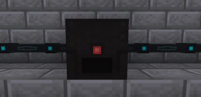

---
navigation:
  title: Magmator
  parent: generators/index.md
  icon: powah:magmator_starter
  position: 1
item_ids:
  - powah:magmator_basic
  - powah:magmator_blazing
  - powah:magmator_hardened
  - powah:magmator_niotic
  - powah:magmator_nitro
  - powah:magmator_spirited
  - powah:magmator_starter
---

# Magmator

The Magmator is an FE generator that generates energy from high temp fluids like Lava. 

High tiers generate more FE/t and it has higher energy output, also they burn the fuel faster with the same energy gained per fuel tick. 

|                                           | Capacity                                              | Generates                                               | Max Extract                                        |
| ----------------------------------------- | ----------------------------------------------------- | ------------------------------------------------------- | -------------------------------------------------- |
| <ItemLink id="powah:magmator_starter" />  | <powah:EnergyCapacity id="powah:magmator_starter" />  | <powah:EnergyGeneration id="powah:magmator_starter" />  | <powah:EnergyMaxIO id="powah:magmator_starter" />  |
| <ItemLink id="powah:magmator_basic" />    | <powah:EnergyCapacity id="powah:magmator_basic" />    | <powah:EnergyGeneration id="powah:magmator_basic" />    | <powah:EnergyMaxIO id="powah:magmator_basic" />    |
| <ItemLink id="powah:magmator_hardened" /> | <powah:EnergyCapacity id="powah:magmator_hardened" /> | <powah:EnergyGeneration id="powah:magmator_hardened" /> | <powah:EnergyMaxIO id="powah:magmator_hardened" /> |
| <ItemLink id="powah:magmator_blazing" />  | <powah:EnergyCapacity id="powah:magmator_blazing" />  | <powah:EnergyGeneration id="powah:magmator_blazing" />  | <powah:EnergyMaxIO id="powah:magmator_blazing" />  |
| <ItemLink id="powah:magmator_niotic" />   | <powah:EnergyCapacity id="powah:magmator_niotic" />   | <powah:EnergyGeneration id="powah:magmator_niotic" />   | <powah:EnergyMaxIO id="powah:magmator_niotic" />   |
| <ItemLink id="powah:magmator_spirited" /> | <powah:EnergyCapacity id="powah:magmator_spirited" /> | <powah:EnergyGeneration id="powah:magmator_spirited" /> | <powah:EnergyMaxIO id="powah:magmator_spirited" /> |
| <ItemLink id="powah:magmator_nitro" />    | <powah:EnergyCapacity id="powah:magmator_nitro" />    | <powah:EnergyGeneration id="powah:magmator_nitro" />    | <powah:EnergyMaxIO id="powah:magmator_nitro" />    |

<Row>
<RecipesFor id="powah:magmator_starter" />
<RecipesFor id="powah:magmator_basic" />
<RecipesFor id="powah:magmator_hardened" />
<RecipesFor id="powah:magmator_blazing" />
<RecipesFor id="powah:magmator_niotic" />
<RecipesFor id="powah:magmator_spirited" />
<RecipesFor id="powah:magmator_nitro" />
</Row>