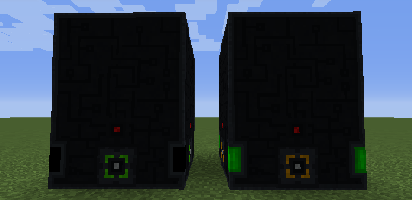

---
navigation:
  title: Reactor
  parent: generators/index.md
  icon: powah:reactor_starter
  position: 4
item_ids:
  - powah:reactor_basic
  - powah:reactor_blazing
  - powah:reactor_hardened
  - powah:reactor_niotic
  - powah:reactor_nitro
  - powah:reactor_spirited
  - powah:reactor_starter
---

# Reactor

The Reactor is a multi-block (FE) generator that use Uraninite as main fuel. 

To build it you will need 36 Reactor block in your hand and placing them in a 3X4 replaceable area, then the reactor will complete building itself automatically. 

|                                          | Capacity                                             | Generation Factor                                      | Max Extract                                       |
| ---------------------------------------- | ---------------------------------------------------- | ------------------------------------------------------ | ------------------------------------------------- |
| <ItemLink id="powah:reactor_starter" />  | <powah:EnergyCapacity id="powah:reactor_starter" />  | <powah:EnergyGeneration id="powah:reactor_starter" />  | <powah:EnergyMaxIO id="powah:reactor_starter" />  |
| <ItemLink id="powah:reactor_basic" />    | <powah:EnergyCapacity id="powah:reactor_basic" />    | <powah:EnergyGeneration id="powah:reactor_basic" />    | <powah:EnergyMaxIO id="powah:reactor_basic" />    |
| <ItemLink id="powah:reactor_hardened" /> | <powah:EnergyCapacity id="powah:reactor_hardened" /> | <powah:EnergyGeneration id="powah:reactor_hardened" /> | <powah:EnergyMaxIO id="powah:reactor_hardened" /> |
| <ItemLink id="powah:reactor_blazing" />  | <powah:EnergyCapacity id="powah:reactor_blazing" />  | <powah:EnergyGeneration id="powah:reactor_blazing" />  | <powah:EnergyMaxIO id="powah:reactor_blazing" />  |
| <ItemLink id="powah:reactor_niotic" />   | <powah:EnergyCapacity id="powah:reactor_niotic" />   | <powah:EnergyGeneration id="powah:reactor_niotic" />   | <powah:EnergyMaxIO id="powah:reactor_niotic" />   |
| <ItemLink id="powah:reactor_spirited" /> | <powah:EnergyCapacity id="powah:reactor_spirited" /> | <powah:EnergyGeneration id="powah:reactor_spirited" /> | <powah:EnergyMaxIO id="powah:reactor_spirited" /> |
| <ItemLink id="powah:reactor_nitro" />    | <powah:EnergyCapacity id="powah:reactor_nitro" />    | <powah:EnergyGeneration id="powah:reactor_nitro" />    | <powah:EnergyMaxIO id="powah:reactor_nitro" />    |

<Row>
<RecipesFor id="powah:reactor_starter" />
<RecipesFor id="powah:reactor_basic" />
<RecipesFor id="powah:reactor_hardened" />
<RecipesFor id="powah:reactor_blazing" />
<RecipesFor id="powah:reactor_niotic" />
<RecipesFor id="powah:reactor_spirited" />
<RecipesFor id="powah:reactor_nitro" />
</Row>