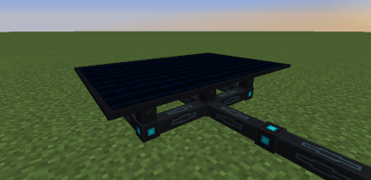

---
navigation:
  title: Solar Panel
  parent: generators/index.md
  icon: powah:solar_panel_starter
  position: 3
item_ids:
  - powah:solar_panel_basic
  - powah:solar_panel_blazing
  - powah:solar_panel_hardened
  - powah:solar_panel_niotic
  - powah:solar_panel_nitro
  - powah:solar_panel_spirited
  - powah:solar_panel_starter
---

# Solar Panel

The Solar Panel is an FE generator that generates energy when exposed to sunlight, high tiers generates more FE/t, any block that stop light above the Solar panel will stop its production. 

|                                              | Capacity                                                 | Generates                                                  | Max Extract                                           |
| -------------------------------------------- | -------------------------------------------------------- | ---------------------------------------------------------- | ----------------------------------------------------- |
| <ItemLink id="powah:solar_panel_starter" />  | <powah:EnergyCapacity id="powah:solar_panel_starter" />  | <powah:EnergyGeneration id="powah:solar_panel_starter" />  | <powah:EnergyMaxIO id="powah:solar_panel_starter" />  |
| <ItemLink id="powah:solar_panel_basic" />    | <powah:EnergyCapacity id="powah:solar_panel_basic" />    | <powah:EnergyGeneration id="powah:solar_panel_basic" />    | <powah:EnergyMaxIO id="powah:solar_panel_basic" />    |
| <ItemLink id="powah:solar_panel_hardened" /> | <powah:EnergyCapacity id="powah:solar_panel_hardened" /> | <powah:EnergyGeneration id="powah:solar_panel_hardened" /> | <powah:EnergyMaxIO id="powah:solar_panel_hardened" /> |
| <ItemLink id="powah:solar_panel_blazing" />  | <powah:EnergyCapacity id="powah:solar_panel_blazing" />  | <powah:EnergyGeneration id="powah:solar_panel_blazing" />  | <powah:EnergyMaxIO id="powah:solar_panel_blazing" />  |
| <ItemLink id="powah:solar_panel_niotic" />   | <powah:EnergyCapacity id="powah:solar_panel_niotic" />   | <powah:EnergyGeneration id="powah:solar_panel_niotic" />   | <powah:EnergyMaxIO id="powah:solar_panel_niotic" />   |
| <ItemLink id="powah:solar_panel_spirited" /> | <powah:EnergyCapacity id="powah:solar_panel_spirited" /> | <powah:EnergyGeneration id="powah:solar_panel_spirited" /> | <powah:EnergyMaxIO id="powah:solar_panel_spirited" /> |
| <ItemLink id="powah:solar_panel_nitro" />    | <powah:EnergyCapacity id="powah:solar_panel_nitro" />    | <powah:EnergyGeneration id="powah:solar_panel_nitro" />    | <powah:EnergyMaxIO id="powah:solar_panel_nitro" />    |

<Row>
<RecipesFor id="powah:solar_panel_starter" />
<RecipesFor id="powah:solar_panel_basic" />
<RecipesFor id="powah:solar_panel_hardened" />
<RecipesFor id="powah:solar_panel_blazing" />
<RecipesFor id="powah:solar_panel_niotic" />
<RecipesFor id="powah:solar_panel_spirited" />
<RecipesFor id="powah:solar_panel_nitro" />
</Row>