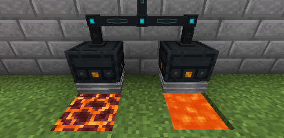

---
navigation:
  title: Thermo Generator
  parent: generators/index.md
  icon: powah:thermo_generator_starter
  position: 2
item_ids:
  - powah:thermo_generator_basic
  - powah:thermo_generator_blazing
  - powah:thermo_generator_hardened
  - powah:thermo_generator_niotic
  - powah:thermo_generator_nitro
  - powah:thermo_generator_spirited
  - powah:thermo_generator_starter
---

# Thermo Generator

The Thermo Generator is an FE generator that generates energy when placed on top of a high temp block/fluid like lava, require a coolant fluid like water to run. 

|                                                   | Capacity                                                      | Generates                                                       | Max Extract                                                |
| ------------------------------------------------- | ------------------------------------------------------------- | --------------------------------------------------------------- | ---------------------------------------------------------- |
| <ItemLink id="powah:thermo_generator_starter" />  | <powah:EnergyCapacity id="powah:thermo_generator_starter" />  | <powah:EnergyGeneration id="powah:thermo_generator_starter" />  | <powah:EnergyMaxIO id="powah:thermo_generator_starter" />  |
| <ItemLink id="powah:thermo_generator_basic" />    | <powah:EnergyCapacity id="powah:thermo_generator_basic" />    | <powah:EnergyGeneration id="powah:thermo_generator_basic" />    | <powah:EnergyMaxIO id="powah:thermo_generator_basic" />    |
| <ItemLink id="powah:thermo_generator_hardened" /> | <powah:EnergyCapacity id="powah:thermo_generator_hardened" /> | <powah:EnergyGeneration id="powah:thermo_generator_hardened" /> | <powah:EnergyMaxIO id="powah:thermo_generator_hardened" /> |
| <ItemLink id="powah:thermo_generator_blazing" />  | <powah:EnergyCapacity id="powah:thermo_generator_blazing" />  | <powah:EnergyGeneration id="powah:thermo_generator_blazing" />  | <powah:EnergyMaxIO id="powah:thermo_generator_blazing" />  |
| <ItemLink id="powah:thermo_generator_niotic" />   | <powah:EnergyCapacity id="powah:thermo_generator_niotic" />   | <powah:EnergyGeneration id="powah:thermo_generator_niotic" />   | <powah:EnergyMaxIO id="powah:thermo_generator_niotic" />   |
| <ItemLink id="powah:thermo_generator_spirited" /> | <powah:EnergyCapacity id="powah:thermo_generator_spirited" /> | <powah:EnergyGeneration id="powah:thermo_generator_spirited" /> | <powah:EnergyMaxIO id="powah:thermo_generator_spirited" /> |
| <ItemLink id="powah:thermo_generator_nitro" />    | <powah:EnergyCapacity id="powah:thermo_generator_nitro" />    | <powah:EnergyGeneration id="powah:thermo_generator_nitro" />    | <powah:EnergyMaxIO id="powah:thermo_generator_nitro" />    |

<Row>
<RecipesFor id="powah:thermo_generator_starter" />
<RecipesFor id="powah:thermo_generator_basic" />
<RecipesFor id="powah:thermo_generator_hardened" />
<RecipesFor id="powah:thermo_generator_blazing" />
<RecipesFor id="powah:thermo_generator_niotic" />
<RecipesFor id="powah:thermo_generator_spirited" />
<RecipesFor id="powah:thermo_generator_nitro" />
</Row>