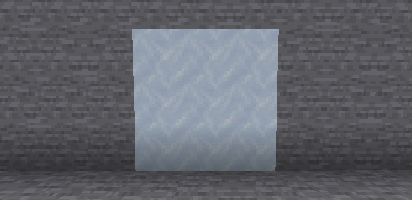

---
navigation:
  title: Dry Ice
  parent: materials/index.md
  icon: powah:dry_ice
  position: 1
---

# Dry Ice

Dry Ice used mainly to cool down reactors, it can be found underground at levels below 64, you can also obtain it by energizing two pieces of blue ice. 
