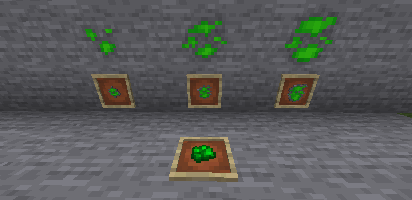

---
navigation:
  title: Uraninite Ore
  parent: materials/index.md
  icon: powah:uraninite_ore_dense
  position: 0
---

# Uraninite Ore

Uraninite Ore is an ore rarely found underground at levels below 64 for poor, below 20 for the normal, and below 0 for dense, and is found in 1 - 5 block deposits. 

An iron or better pickaxe is needed to mine it, and when mined it will drop 1 piece of Raw Uraninite based on the ore type (the amount dropped are effected by fortune). 
