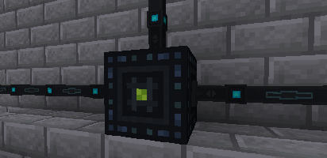

---
navigation:
  title: Ender Cells
  parent: storage_transfer/index.md
  icon: powah:ender_cell_starter
  position: 2
item_ids:
  - powah:ender_cell_basic
  - powah:ender_cell_blazing
  - powah:ender_cell_hardened
  - powah:ender_cell_niotic
  - powah:ender_cell_nitro
  - powah:ender_cell_spirited
  - powah:ender_cell_starter
---

# Ender Cells

The Ender Cell its a block used to store energy (FE) to a specific channel of the ender network of the owner. 

You can access the energy stored of a selected channel from anywhere in the world if the Ender Cell that you want to transfer power from/to have an active channel with a valid capacity. 

|                                             | Max I/O                                              |
| ------------------------------------------- | ---------------------------------------------------- |
| <ItemLink id="powah:ender_cell_starter" />  | <powah:EnergyMaxIO id="powah:ender_cell_starter" />  |
| <ItemLink id="powah:ender_cell_basic" />    | <powah:EnergyMaxIO id="powah:ender_cell_basic" />    |
| <ItemLink id="powah:ender_cell_hardened" /> | <powah:EnergyMaxIO id="powah:ender_cell_hardened" /> |
| <ItemLink id="powah:ender_cell_blazing" />  | <powah:EnergyMaxIO id="powah:ender_cell_blazing" />  |
| <ItemLink id="powah:ender_cell_niotic" />   | <powah:EnergyMaxIO id="powah:ender_cell_niotic" />   |
| <ItemLink id="powah:ender_cell_spirited" /> | <powah:EnergyMaxIO id="powah:ender_cell_spirited" /> |
| <ItemLink id="powah:ender_cell_nitro" />    | <powah:EnergyMaxIO id="powah:ender_cell_nitro" />    |

<Row>
<RecipesFor id="powah:ender_cell_starter" />
<RecipesFor id="powah:ender_cell_basic" />
<RecipesFor id="powah:ender_cell_hardened" />
<RecipesFor id="powah:ender_cell_blazing" />
<RecipesFor id="powah:ender_cell_niotic" />
<RecipesFor id="powah:ender_cell_spirited" />
<RecipesFor id="powah:ender_cell_nitro" />
</Row>