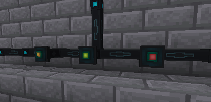

---
navigation:
  title: Ender Gates
  parent: storage_transfer/index.md
  icon: powah:ender_gate_starter
  position: 3
item_ids:
  - powah:ender_gate_basic
  - powah:ender_gate_blazing
  - powah:ender_gate_hardened
  - powah:ender_gate_niotic
  - powah:ender_gate_nitro
  - powah:ender_gate_spirited
  - powah:ender_gate_starter
---

# Ender Gates

Transfer energy between the adjacent block and the ender network. 

Unlike the Ender cell you can not Upgrade the network from it. 

|                                             | Max I/O                                              |
| ------------------------------------------- | ---------------------------------------------------- |
| <ItemLink id="powah:ender_gate_starter" />  | <powah:EnergyMaxIO id="powah:ender_gate_starter" />  |
| <ItemLink id="powah:ender_gate_basic" />    | <powah:EnergyMaxIO id="powah:ender_gate_basic" />    |
| <ItemLink id="powah:ender_gate_hardened" /> | <powah:EnergyMaxIO id="powah:ender_gate_hardened" /> |
| <ItemLink id="powah:ender_gate_blazing" />  | <powah:EnergyMaxIO id="powah:ender_gate_blazing" />  |
| <ItemLink id="powah:ender_gate_niotic" />   | <powah:EnergyMaxIO id="powah:ender_gate_niotic" />   |
| <ItemLink id="powah:ender_gate_spirited" /> | <powah:EnergyMaxIO id="powah:ender_gate_spirited" /> |
| <ItemLink id="powah:ender_gate_nitro" />    | <powah:EnergyMaxIO id="powah:ender_gate_nitro" />    |

<Row>
<RecipesFor id="powah:ender_gate_starter" />
<RecipesFor id="powah:ender_gate_basic" />
<RecipesFor id="powah:ender_gate_hardened" />
<RecipesFor id="powah:ender_gate_blazing" />
<RecipesFor id="powah:ender_gate_niotic" />
<RecipesFor id="powah:ender_gate_spirited" />
<RecipesFor id="powah:ender_gate_nitro" />
</Row>