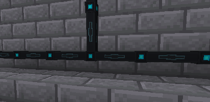

---
navigation:
  title: Energy Cables
  parent: storage_transfer/index.md
  icon: powah:energy_cable_starter
  position: 1
item_ids:
  - powah:energy_cable_basic
  - powah:energy_cable_blazing
  - powah:energy_cable_hardened
  - powah:energy_cable_niotic
  - powah:energy_cable_nitro
  - powah:energy_cable_spirited
  - powah:energy_cable_starter
---

# Energy Cables

Cables are used to transfer power between machines. 

You can change transfer mode of by right-clicking a cable using <ItemLink id="powah:wrench" /> with Config mode selected. 

|                                               | Max I/O                                                |
| --------------------------------------------- | ------------------------------------------------------ |
| <ItemLink id="powah:energy_cable_starter" />  | <powah:EnergyMaxIO id="powah:energy_cable_starter" />  |
| <ItemLink id="powah:energy_cable_basic" />    | <powah:EnergyMaxIO id="powah:energy_cable_basic" />    |
| <ItemLink id="powah:energy_cable_hardened" /> | <powah:EnergyMaxIO id="powah:energy_cable_hardened" /> |
| <ItemLink id="powah:energy_cable_blazing" />  | <powah:EnergyMaxIO id="powah:energy_cable_blazing" />  |
| <ItemLink id="powah:energy_cable_niotic" />   | <powah:EnergyMaxIO id="powah:energy_cable_niotic" />   |
| <ItemLink id="powah:energy_cable_spirited" /> | <powah:EnergyMaxIO id="powah:energy_cable_spirited" /> |
| <ItemLink id="powah:energy_cable_nitro" />    | <powah:EnergyMaxIO id="powah:energy_cable_nitro" />    |

<Row>
<RecipesFor id="powah:energy_cable_starter" />
<RecipesFor id="powah:energy_cable_basic" />
<RecipesFor id="powah:energy_cable_hardened" />
<RecipesFor id="powah:energy_cable_blazing" />
<RecipesFor id="powah:energy_cable_niotic" />
<RecipesFor id="powah:energy_cable_spirited" />
<RecipesFor id="powah:energy_cable_nitro" />
</Row>