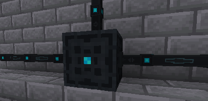

---
navigation:
  title: Energy Cells
  parent: storage_transfer/index.md
  icon: powah:energy_cell_starter
  position: 0
item_ids:
  - powah:energy_cell_basic
  - powah:energy_cell_blazing
  - powah:energy_cell_creative
  - powah:energy_cell_hardened
  - powah:energy_cell_niotic
  - powah:energy_cell_nitro
  - powah:energy_cell_spirited
  - powah:energy_cell_starter
---

# Energy Cells

The Energy Cell its a block used to store energy (FE). 

Can Also be used to add capacity to an Ender Network channel by Shift-clicking it to an Ender Cell GUI, if the Energy Cell contains energy then will also be applied to the ender network channel. 

|                                              | Capacity                                                 | Max I/O                                               |
| -------------------------------------------- | -------------------------------------------------------- | ----------------------------------------------------- |
| <ItemLink id="powah:energy_cell_starter" />  | <powah:EnergyCapacity id="powah:energy_cell_starter" />  | <powah:EnergyMaxIO id="powah:energy_cell_starter" />  |
| <ItemLink id="powah:energy_cell_basic" />    | <powah:EnergyCapacity id="powah:energy_cell_basic" />    | <powah:EnergyMaxIO id="powah:energy_cell_basic" />    |
| <ItemLink id="powah:energy_cell_hardened" /> | <powah:EnergyCapacity id="powah:energy_cell_hardened" /> | <powah:EnergyMaxIO id="powah:energy_cell_hardened" /> |
| <ItemLink id="powah:energy_cell_blazing" />  | <powah:EnergyCapacity id="powah:energy_cell_blazing" />  | <powah:EnergyMaxIO id="powah:energy_cell_blazing" />  |
| <ItemLink id="powah:energy_cell_niotic" />   | <powah:EnergyCapacity id="powah:energy_cell_niotic" />   | <powah:EnergyMaxIO id="powah:energy_cell_niotic" />   |
| <ItemLink id="powah:energy_cell_spirited" /> | <powah:EnergyCapacity id="powah:energy_cell_spirited" /> | <powah:EnergyMaxIO id="powah:energy_cell_spirited" /> |
| <ItemLink id="powah:energy_cell_nitro" />    | <powah:EnergyCapacity id="powah:energy_cell_nitro" />    | <powah:EnergyMaxIO id="powah:energy_cell_nitro" />    |
| <ItemLink id="powah:energy_cell_creative" /> | <powah:EnergyCapacity id="powah:energy_cell_creative" /> | <powah:EnergyMaxIO id="powah:energy_cell_creative" /> |

<Row>
<RecipesFor id="powah:energy_cell_starter" />
<RecipesFor id="powah:energy_cell_basic" />
<RecipesFor id="powah:energy_cell_hardened" />
<RecipesFor id="powah:energy_cell_blazing" />
<RecipesFor id="powah:energy_cell_niotic" />
<RecipesFor id="powah:energy_cell_spirited" />
<RecipesFor id="powah:energy_cell_nitro" />
<RecipesFor id="powah:energy_cell_creative" />
</Row>