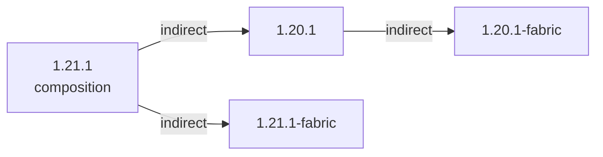

### 总概



```
1.21.1 (composition)
 ├── 1.21.1-fabric
 └── 1.20.1
      └── 1.20.1-fabric
```

### 传送区域

- [1.20.1](/projects/assets/all-the-wood-weve-got/woodwevegot/1.20)
- [1.21.1](/projects/assets/all-the-wood-weve-got/woodwevegot/1.21)
- [1.20.1-fabric](/projects/assets/all-the-wood-weve-got/woodwevegot/1.20-fabric)
- [1.21.1-fabric](/projects/assets/all-the-wood-weve-got/woodwevegot/1.21-fabric)