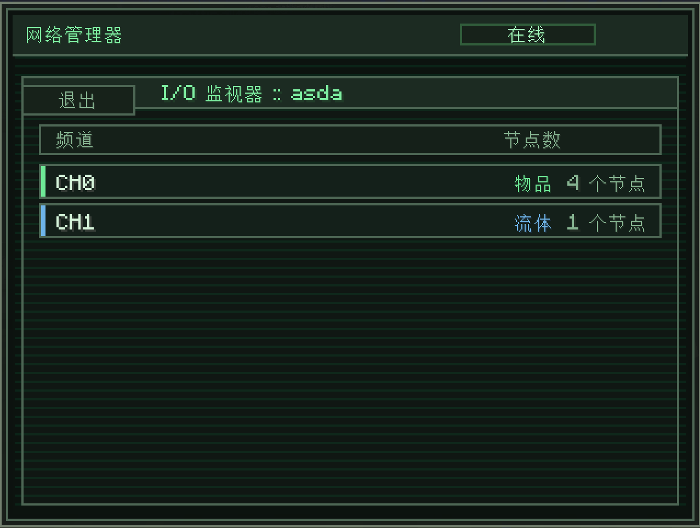
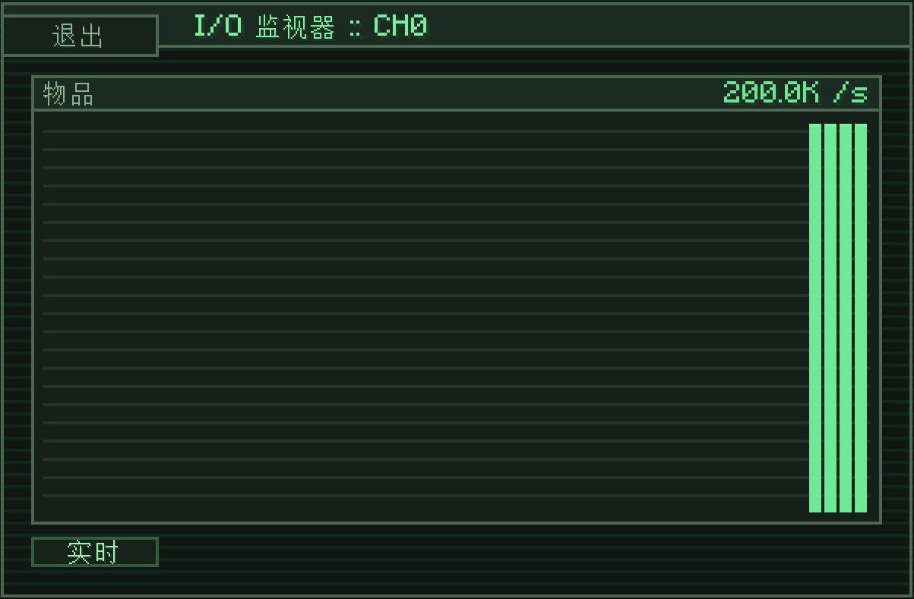

---
navigation:
  title: I/O监视器
  parent: computer/index.md
  position: 2
---

# I/O监视器

所挂载网络的实时遥测数据视图。其中会显示网络中的每一个活动频道——按频道索引聚合汇总——还可单独查看其中一个频道的吞吐量图表。

该界面可在所挂载网络的子系统按钮处打开。点击左上角的**退出**可返回至网络目录。

## 频道列表

每一行都对应至少有一个运行中节点的频道索引：

- **CH0** / **CH1** / ……：频道索引（0到8）。对应节点界面中的频道槽编号。
- **类型**：频道正在传输的资源，**物品**、**流体**、**能量**、**化学品**、**魔源**。各个类型使用相应的颜色。
- **节点计数**：该网络中已启用节点的个数。

各行左侧还有一个匹配频道类型的**带色标记**——绿色为物品，蓝色为流体，以此类推。它可以用来快捷确定频道类型，无需查看右侧文本。

聚合**按频道索引**进行，不按节点。若有10个节点同时在CH0上进行物品传输，那么列表内只会有一行`CH0 物品 10 个节点`，而不会分成10行。点击其中一行可查看详细图表。

## 吞吐量图表

点击频道行可打开其图表。图表会显示该频道的**实时传输吞吐量时间线**：

- 总计**120个采样点**。一个纵条对应一次采样，最右侧的最新。
- 随着遥测数据抵达，大约每一秒更新一次。
- 刻度自适应于峰值，表头会显示峰值（如`200.0K / s`），单位随类型选定：
  - **物品**：物品每秒。
  - **流体**：毫桶每秒（`mB/s`）。
  - **能量**：Forge能量/RF每秒。
  - **化学品**：毫桶每秒。
  - **魔源**：魔源每秒。
- 左下角的**实时**标记会在每次有新数据到达时亮起。

## 读懂图表

- 稳定出现高纵条 = 吞吐量恒定。设施正努力工作。
- 空图表 = 存在频道，但未在进行运输。可检查过滤器、状态，以及来源方块实际有无存储资源。
- 多有尖峰的图表 = 脉冲式传输。通常是有延迟频道（高延迟）或间歇式生产来源。
- 突然跌落至零 = 频道停止工作（来源耗尽，受红石信号控制关闭，节点卸载于网络等）。

点击图表界面上的**退出**可返回至频道列表。
