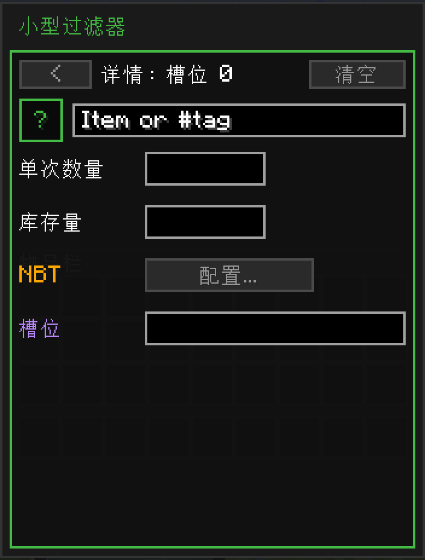
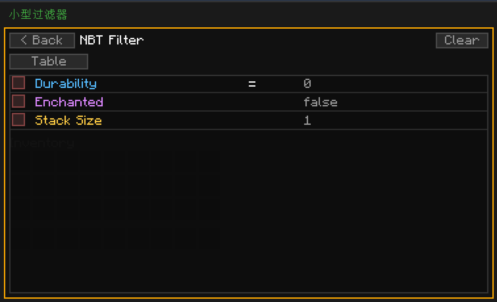

---
navigation:
  title: 高级过滤
  parent: filters/index.md
  position: 6
---

# 高级过滤

小型、中型、大型过滤器分别有9、18、27个过滤条目槽。最简单是使用方法是直接放入物品，不过其实每个槽位都有隐藏的**详情**页面，内有条目独有的选项，可让过滤器的匹配能力大大超出精确物品匹配。

本页会介绍详情页面和下属的NBT页面。其中选项的功能在小型、中型、大型过滤器中一致——它们的区别只在于槽位数量的多少。

## 打开详情页面

手持过滤器打开（右击），再**Ctrl+左击已有资源的条目槽**。视图会切换至该槽位的详情页面。

其中可以设置下文会提到的所有条目独有选项。顶部的`<`按钮可用于返回主界面。右上角的`清空`按钮可清空本条目的所有字段，并返回到主界面。

## 物品或#标签（Item or #tag）

顶部的输入框用于控制**该条目匹配什么**。共有两者格式：

- **精确物品ID**：如`minecraft:iron_ingot`。仅匹配该物品。
- **标签**：前缀`#`，如`#c:ores`或`#minecraft:planks`。匹配**所有**带该标签的物品。

也可以两者都不使用——可以留空该输入框，只使用NBT规则，或只使用槽位设置。未设置物品/标签、但设置了NBT规则的条目会匹配所有符合NBT条件的物品。

输入框左侧的小型`?`按钮可唤起一条帮助文本，用于提示可用的格式。

**输出端**：仅从来源方块抽出匹配ID/标签的物品。
**输入端**：仅向目的地方块送入匹配ID/标签的物品。其他资源不会通过该条目的判断。

## 单次数量

每次传输移动多少物品，仅作用于该条目，覆盖频道设置。此设置**不会加到**频道的单次数量设置上——它只会为该条目的传输数量设置上限。

- 设为`0`（或留空），则使用频道的单次数量设置。
- 设为正数，可设置该条目每次操作传输量的上限。

用例：频道的单次数量为64，但需要铁粒每次仅传输16个。可将铁粒放入槽位，打开详情，将单次数量设为16。同频道下的其他条目仍会使用频道设置中的64。

**输出端**：设置该条目每次操作的抽取数量上限。
**输入端**：忽略。输出端决定单次数量；输入端不对吞吐量设限。可在输出端设置单次数量以控制流量。

## 库存

条目的数量阈值。仅这一个字段的意义在输出端和输入端上**存在不同**：

- **输出端**：库存的意义是**存量**。若抽取后会导致来源方块中对应资源的数量低于该值，则不进行抽取。示例：将煤炭条目的库存设为`8`，输出端便会在来源箱子中保留8个煤炭。
- **输入端**：库存的意义是**上限**。目的地中资源已达到库存量时，不再接收。示例：将铁锭条目的库存设为`64`，输入端便会在目的地已有64个铁锭时停止补货。

设为`0`（或留空）可禁用该阈值。很适合向熔炉发送燃料，又不过量发送；也很适合在农场箱子中保留足量的种子，同时抽空所有其他资源。

## NBT规则

点击**配置**可打开此条目的NBT规则页面。NBT规则可用于在物品/标签匹配之上，进一步匹配物品的数据组件（魔咒、损坏值、自定义名称、堆叠数量、自定义NBT标签等）。

子页面有两个模式：

- **表格**（**Table**）（默认）：点击各行以创建规则：耐久度、已附魔、堆叠数量，以及你输入的其他自定义NBT路径。每一条规则都有一个运算符（`=`等于，`!=`不等于）和一个值。**每个条目最多6条规则**。
- **原始SNBT**（**Raw SNBT**）：可供粘贴原始SNBT段的文本框。条目会匹配包含所有指定NBT的物品。仅适用于高级功能——适合给无法在表格中简洁表示的匹配模式。

所有规则左侧都有一个勾选框——勾选可启用该规则。未勾选的规则会被忽略。顶部的`清空`（`Clear`）按钮可清除条目的所有NBT规则，并返回到详情页面。`< 返回`（`< Back`）则只会返回详情页面。

### 常见NBT规则示例

- **仅受损工具**：添加规则`耐久度`（`Durability`）`!=` `0`。仅匹配损失了部分耐久度的工具。
- **仅附魔书**：添加规则`已附魔`（`Enchanted`）`=` `true`。仅匹配至少有一条魔咒的物品。
- **仅不可堆叠物品**：添加规则`堆叠数量`（`Stack Size`）`=` `1`。适用于路由单个受损的工具，而不会发送完好物品的堆叠。

**输出端**：仅抽取NBT匹配已启用规则的物品。
**输入端**：仅接收NBT匹配已启用规则的物品。未通过规则判定的物品会留在网络中，供其他输入端使用。

## 槽位

限制此条目能读/写所依附方块的哪些**槽位索引**。适合让条目仅访问面敏感机器和多槽位容器中的特定槽位。

格式：逗号分隔的槽位索引/范围列表。示例：

- `0-8`：槽位0至槽位8，两端包含。
- `0,3,5`：仅槽位0、3、5。
- `0-3, 5`：槽位0至3，再加槽位5。

有效槽位索引范围为**0到53**（标准的Minecraft容器最大值就在53上下）。留空可让条目访问方块公开的所有槽位。

用例：熔炉的槽位索引为0（输入）、1（燃料）、2（输出）。将煤炭条目的槽位设为`1`，可让煤炭只进入燃料槽。将可烧炼资源的槽位设为`0`，它们便不会进入燃料槽。

**输出端**：限制抽取频道**来源**方块的哪些槽位。仅会读取指定的槽位。
**输入端**：限制送入频道**目的**方块的哪些槽位。仅会写入指定的槽位。示例：将熔炉输入端的槽位设为`0`，可让可烧炼资源只进入输入槽，即便燃料槽为空且能接受该资源也是如此。

## 清空操作

- **详情页面的清空**：清空条目的所有设置：物品/标签、单次数量、库存、槽位、所有NBT规则。
- **NBT子页面的清空**：仅清空NBT规则；物品/标签、单次数量、库存、槽位均不变。

## 太长不读

[小型](small.md)、[中型](medium.md)、[大型](big.md)过滤器主界面的所有槽位都不只是单个物品的匹配项。打开详情页面，就可将该槽位变为精细的匹配规则：按标签匹配、覆盖单次数量、保留一定库存量、按魔咒限制、仅作用于特定容器槽位——这一切都可按条目单独设置，无需专用的过滤器物品。
