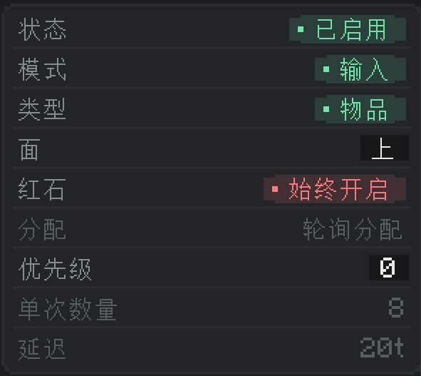
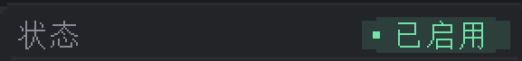
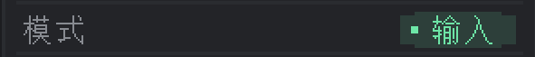
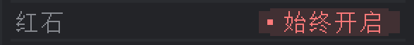

---
navigation:
  title: 频道设置
  parent: nodes/index.md
  position: 2
---

# 频道设置

此面板控制[标题](header.md)中所选频道的行为。每个节点都有9个频道，每个频道都有独立的一套设置——在面板内修改只会影响当前查看的那个频道。

**Alt+左击/右击可分别将设置设为最大/最小值。**

点击界面顶部的频道编号按钮可切换改动应用于哪一个频道。

## 状态

**它是什么：**&zwnj;频道的开关。

**它的功能：**

- **已启用**：频道正常运作。每刻进行一次处理（受延迟、红石等影响）。
- **已禁用**：传输引擎会跳过该频道。不会抽出物品，不会送入物品，不进行红石条件检验。什么都不会做。

**如何改动：**&zwnj;左击值按钮可在已启用和已禁用间切换。

**小提示：**&zwnj;已禁用的频道会保留其他所有设置（过滤器、单次数量、延迟等）不变。禁用操作不会删除任何东西，只是暂停了频道。重新启用即可让频道恢复原样。

## 模式

**它是什么：**&zwnj;该频道的传输方向。

**它的功能：**

- **输出**：从节点所依附的方块中**抽取**资源。输出端是传输的驱动端：它们会检索网络中同频道下相匹配的输入端，并向它们输出资源。
- **输入**：向节点所依附的方块**送入**资源。输入端是被动端：它们会等候同频道下的输出端输出资源。

**如何改动：**&zwnj;左击值按钮可在输出和输入间切换。

**小提示：**&zwnj;只有输入端（或只有输出端）的网络什么都不会做。同频道下两者都至少有一个才能传输资源。

## 类型

**它是什么：**&zwnj;频道所传输资源的类型。

**它的功能：**&zwnj;让引擎检查所依附方块的什么能力：

- **物品**：物品容器（箱子、熔炉、漏洞、AE2接口等）中的物品堆叠。
- **流体**：储罐中的流体，以毫桶（mB）计。
- **能量**：能量存储空间中的Forge能量/RF。

**如何改动：**&zwnj;左击值按钮可在可用类型间循环切换。

**小提示：**&zwnj;不是所有方块都支持所有类型。若方块在对应面没有相应能力，频道便什么都不会做，且不会发出通知。把物品节点贴在流体储罐上便什么都不会传输，因为储罐没有物品存储空间。

节点还支持两种额外类型——化学品（通用机械）和魔源（新生魔艺），但都需要对应升级才可使用。详情见升级页面。

## 面

**它是什么：**&zwnj;频道与所依附方块的哪一面进行交互。

**它的功能：**&zwnj;部分方块的行为会因交互面的不同而发生变化。经典的例子就是熔炉：顶面接受/取出待烧炼的物品，前面接受燃料，底面可取出产物。面设置可为频道指定交互面。

- **上/下/北/东/南/西**：仅所选面。引擎会探测方块在该面上的物品容器（或流体容器、能量存储空间），并选用该面公开的槽位。
- **所有**：使用同一个处理程序管理方块的每一面。频道会汇总方块每一面的存储能力，并将方块视作同一个物品槽位/流体容器/能量缓存组。若有多个面公开了同一个处理程序（很常见，大多数方块在所有面公开的都是同一个），还会进行去重。

**如何改动：**&zwnj;左击以循环切换至下一个面（顺序为上 → 下 → 北 → 东 → 南 → 西 → 所有 → 上……）。

**小提示：**&zwnj;对于具有面敏感容器的方块（熔炉、酿造台、部分机器）而言，每一面公开的都可能会是*不同*的槽位组。在熔炉上使用**所有**会同时向频道公开输入、燃料、输出槽，通常而言并非希望达成的效果。可以选择特定面，以让过滤器的作用范围符合预期。

## 红石

**它是什么：**&zwnj;频道的红石控制。

**它的功能：**&zwnj;引擎会检查**节点所依附方块**的红石信号（受拉杆、红石火把、红石粉、红石比较器等毗邻方块影响）。并根据该信号启用或禁用频道：

- **始终开启**：忽略信号。
- **始终关闭**：永不运行。和状态已禁用效果相同，但此设置可让频道维持在启用状态。
- **高红石信号**：仅在有红石信号时运行（强度>0）。
- **低红石信号**：仅在无红石信号时运行（强度=0）。

**如何改动：**&zwnj;左击以循环切换至下一模式。

**禁用于输入端：**&zwnj;此行会在模式为输入端时禁用。红石限制仅适用于输出端（因为传输是由输出端驱动的）。

## 分配

**它是什么：**&zwnj;输出端如何在同频道下多个匹配的输入端中进行挑选。

**它的功能：**&zwnj;仅有一个输入端时，此设置什么都不会做。有多个输入端时，挑选顺序如下：

- **优先级**：按输入端的**优先级**排序。数值较大者优先。数值相同时则随机选定。
- **最近优先**：优先选择距离输出端最近的输入端（直线距离）。
- **最远优先**：与最近优先相反，优先选择距离最远的。
- **轮询分配**：平均轮转。每次成功传输都会将轮转指针指向下一个输入端。

**如何改动：**&zwnj;左击以循环切换至下一模式。

**小提示：**&zwnj;轮询分配的轮转指针会在**不同刻间保持**。即它不会在游戏刻间重置，只会向前移动。该设置能避免循环每刻重置，可在较长的运行时中保证公平轮转。

**禁用于输入端：**&zwnj;此行会在模式为输入端时禁用。分配设置只在输出端有实际意义。

## 优先级

**它是什么：**&zwnj;附加于该频道的较小整数值。范围：**–99到+99**。

**它的功能：**&zwnj;供分配设置为**优先级**的输出端使用。输出端会按照此数为目标输入端排序，值大者优先，并按此顺序传输。高优先级输入端会先于低优先级输入端收到资源。

**如何改动：**&zwnj;左击数字框以打开文本框，输入在-99和99之间的数，然后按Enter。

**小提示：**&zwnj;优先级仅在分配设置为优先级时有效。此值会在最近优先/最远优先/轮询分配模式下被忽略——输出端不会读取该值。可为希望优先传输的**输入端**设置优先级，不应在输出端设置。

## 单次数量

**它是什么：**&zwnj;单次传输操作最多可移动的资源量。

**它的功能：**&zwnj;为单次传输量设置上限。单位随类型而定：

- **物品**：物品数量（例如，单次数量为64 = 一次最多一整组）。
- **流体**：毫桶（例如，单次数量为1000 = 一次最多一桶）。
- **能量**：Forge能量/RF每操作。

**如何改动：**&zwnj;左击数字框以打开文本框，输入新值，然后按Enter。最小可为1。

**小提示：**&zwnj;单次数量受节点升级的限制。若升级仅允许单次传输500，即便是输入了10,000，引擎也只会使用500。安装高等级的升级可增加上限，详情见[性能升级](upgrades-performance.md)。

**禁用于输入端：**&zwnj;此行会在模式为输入端时禁用。单次数量由输出端决定。

## 延迟

**它是什么：**&zwnj;该频道传输操作之间的冷却，以**刻**计。`20t`代表20刻，合1秒。

**它的功能：**&zwnj;在成功传输之后，频道会等待所设刻，然后再次尝试传输。可用于限制频道，以免所有频道每时每刻都在传输。

**如何改动：**&zwnj;左击数字框以打开文本框，输入新值，然后按Enter。最小可为1刻。

**小提示：**&zwnj;能量频道会**忽略延迟**。引擎会强制让能量频道每刻（换言之，立即）传输，而忽略该行的设置。因此能量类型频道的延迟行会被禁用。

**小提示（升级）：**&zwnj;延迟受升级等级的最小延迟限制。若升级仅允许10，即便是输入了1，引擎也只会使用10。高等级的升级可缩短最小延迟。

**禁用于输入端：**&zwnj;此行会在模式为输入端时禁用。输出端决定了发送的间隔。

---

本页的每一行都仅作用于所选频道。可在[标题](header.md)处切换频道，或者在[过滤器与升级](filters-upgrades.md)中设置共享过滤器/升级。
