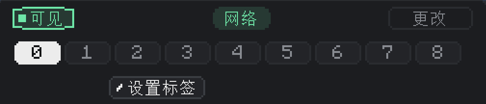

---
navigation:
  title: 标题
  parent: nodes/index.md
  position: 1
---

# 标题

标题位于节点配置界面的顶部。它有三项功能：管理节点在世界中的渲染方式、指定节点属于哪个网络、从9个频道中选取一个进行编辑。

## 可见性

**它是什么：**&zwnj;控制节点在世界中如何渲染的切换器。

**它的功能：**

- **可见**（默认）：节点**始终**不透明渲染，无论手持扳手与否。
- **隐藏**：节点平常**不**渲染。它们只会在手持扳手时出现，且不透明度约为可见模式的三分之一，以便查看和交互。

可见性只是视觉效果。可见和隐藏的节点在传输资源上没有区别。

**如何改动：**&zwnj;左击按钮。文本会在**可见**和**隐藏**间切换，切换后立即生效。电脑节点表中的**显示**/**隐藏**按钮可用于批量切换网络中的所有节点。

可以在调试完毕后隐藏节点，可以让观感更清晰；若需要再找到节点，拿起扳手即可。

## 网络

**它是什么：**&zwnj;标题中央的绿色药片形标记。它显示了节点所属网络的名称。

**它的功能：**&zwnj;显示所属网络的名称。新节点的默认名称是**网络**，因此名称为“网络”代表当前网络为默认名称，为其他文本则代表网络已重命名。

**如何改动：**&zwnj;标记不是按钮。如需更改节点所属网络，请使用旁边的**更改**按钮。

为被分配网络的节点没有功能——在分配网络前所有9个频道都无法使用。

## 更改

**它是什么：**&zwnj;网络名称标记右侧的按钮。

**它的功能：**&zwnj;打开网络挑选器界面。其中可以：

- 挑选一个现有的网络，让节点加入其中。
- 输入一个新名称（最多32个字符）以新建网络，同时让节点加入。
- 让节点离开当前网络。

**如何更改网络：**&zwnj;点击**更改**，而后选择其中一个列出的网络，或是输入新名称并确认。节点会立刻加入网络，主界面也会回到频道配置视图。

可以用它将节点分入多个网络，并入同一个网络，或是重命名节点所属的网络。

## 频道选择器

**它是什么：**&zwnj;一行从**0**到**8**的九个数字按钮。它们对应着节点的9个频道。

**它的功能：**&zwnj;挑选下方设置界面中显示了哪个频道。标题下方的状态、模式、类型、过滤器、升级等设置进作用于此处选择的频道。

**指示视效：**&zwnj;

- 数字外有**红色边框** = 当前选中该频道（你正在编辑该频道）。
- 数字旁有**绿色点** = 该频道的状态不为已禁用（即已启用、正在运作）。
- 无边框且无点 = 频道存在但未启用也未被选中。

启用后，所有9个频道都会同时运作。选择器仅会选择你当前正*查看*哪个频道，而不会决定频道是否已*启用*。

**如何更改频道：**

- **单击**频道编号以选择。下方的设置界面改为显示该频道。
- **双击**已选中的频道编号以重命名。此时会出现一个文本框，可在其中输入自定义名称（最多24个字符）。按Enter以保存，点击文本框外部以取消。

**频道命名：**&zwnj;可以为每个频道单独取一个短名称，该名称与节点的标签相互独立。此名称只会在鼠标悬停与频道按钮时显示，形式为写有该名称的提示框。若尚未设置名称，提示框会给出双击设置的提示。

名称只是装饰效果——它们不会影响传输。可以用它按目的给频道取名，如`输入`、`输出`、`燃料`、`缓存`、`溢流`等，以免后续查看节点时忘记。

## 设置标签

**它是什么：**&zwnj;频道选择器下方的按钮。

**它的功能：**&zwnj;为整个节点分配一个文本标签。标签与网络名称和频道名称相互独立——它们是组织设置相同节点的方式，能让这些节点的频道设置保持同步。

**如何改动：**&zwnj;点击**设置标签**。此时会打开一个文本框，附带包含网络中已有标签的下拉列表。其中可以：

- 从下拉列表中挑选一个标签，加入该分组。
- 输入一个新标签（最多48个字符），按Enter以新建分组。

留空文本框时确认可清空标签。

**为何重要：**&zwnj;网络至少有两个节点的标签相同时，对其中一个做出的改动会自动复制到标签组内的所有其他节点。其中包含频道模式、类型、过滤器、单次数量、延迟、过滤器物品、过滤器配置。升级不会进行同步，单次数量复制后也会根据节点升级进行限制。

惯例使用方法：将20个熔炉上节点的标签均设为`熔炉`，配置其中一个，其他19个都将自动同步。后续的对任意一个的微调也将同步给所有节点。

标签也会在电脑的节点表中显示，同标签的节点会归入同一组，以便浏览查看。
