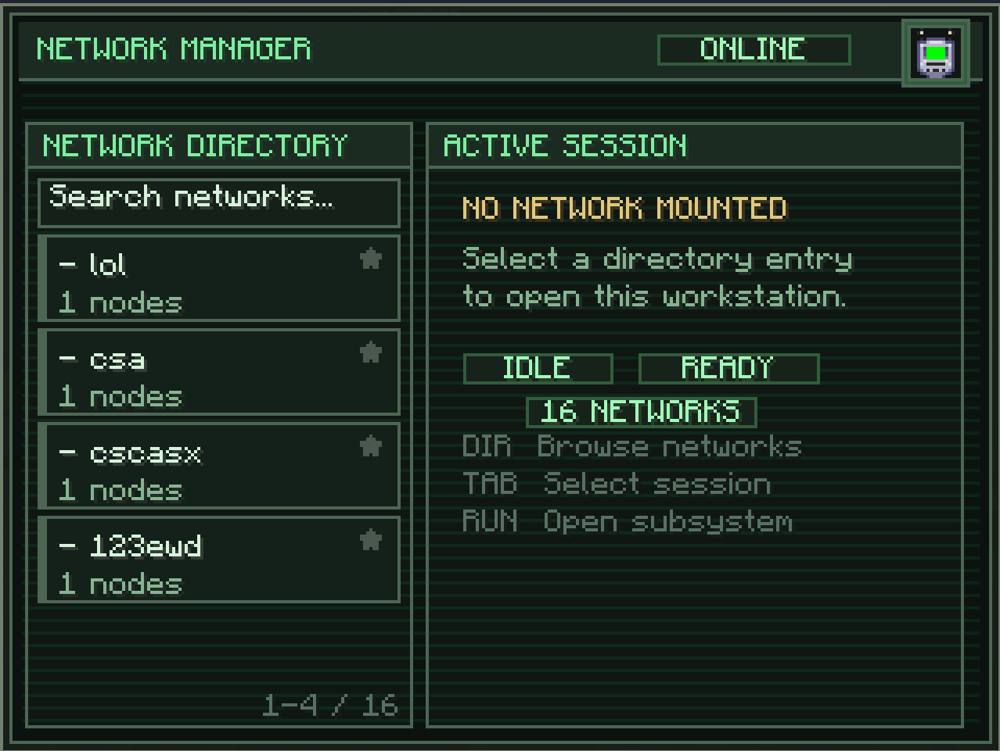

# Computer

The Computer is a placeable block that gives you a terminal interface for watching and managing your logistics networks. Drop one in your base, right-click it, and you get a full dashboard: list every network, see live throughput for every active channel, jump directly to any node's config, and toggle node visibility in bulk.

## Opening The Computer

Right-click a placed Computer block to open the **Network Manager** screen. If you have a [Wrench](../wrench/index.md) anywhere in your inventory, the Computer **auto-loads** one copy of it into the drive bay slot in the top-right corner. The wrench is borrowed, not consumed — close the screen and the wrench stays on the Computer until you retrieve it manually.

The drive bay slot is only interactable on the Network Directory page. If you switch to the I/O Monitor or Node Table view you will not be able to touch the wrench slot until you back out.

## The Three Subsystems

Once you pick a network from the directory, you can jump into either of the two subsystems. Covered in their own chapters:

- [Network Directory](network-directory.md) — the list of networks on the left; search, pinning, mounting a network.
- [I/O Monitor](io-monitor.md) — aggregated channel throughput with live graphs (120 data points per channel).
- [Node Table](node-table.md) — every node on the mounted network, grouped by label, with per-row actions.

Until a network is mounted, the right-hand pane just says **No Network Mounted**. Pick one from the directory and the subsystem buttons unlock.

## Starred Networks

Every network entry in the directory has a small **star** icon on the right side. Click it to pin that network to the top of the list. Pinned (starred) networks sort first; unpinned networks follow. The star state is stored on the Computer block itself — it persists across sessions and is per-Computer (two Computers can have different favourites).

Networks are **not owner-locked**. Every Computer on a server can see every network on that server, regardless of who placed it.

## Crafting Recipe

<RecipeFor id="logisticsnetworks:computer" />
