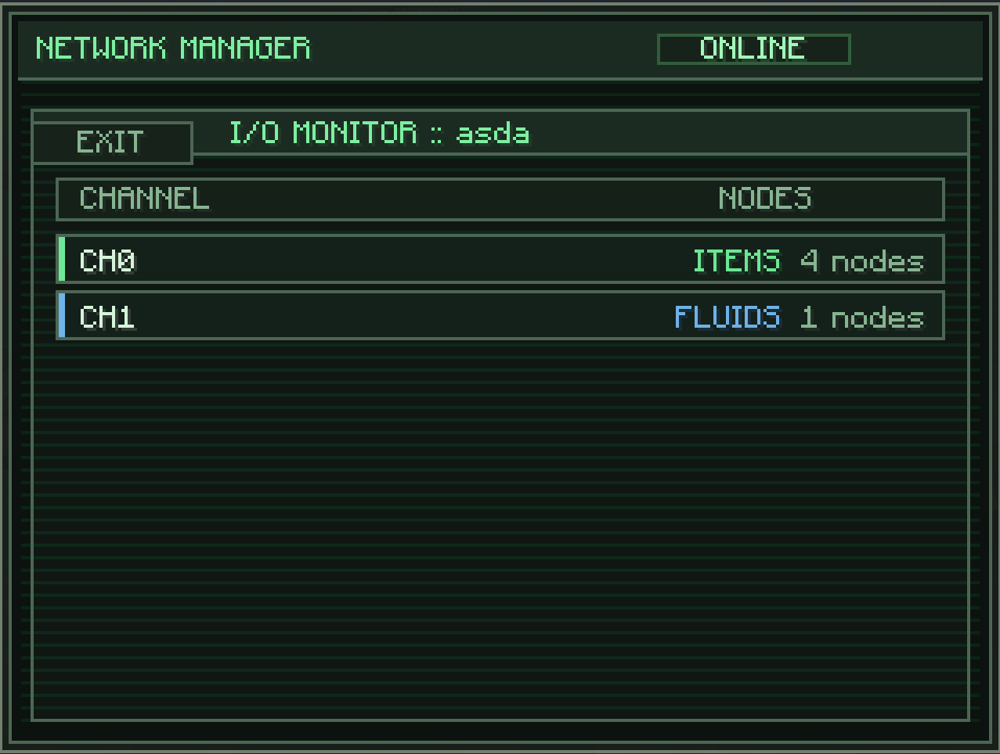
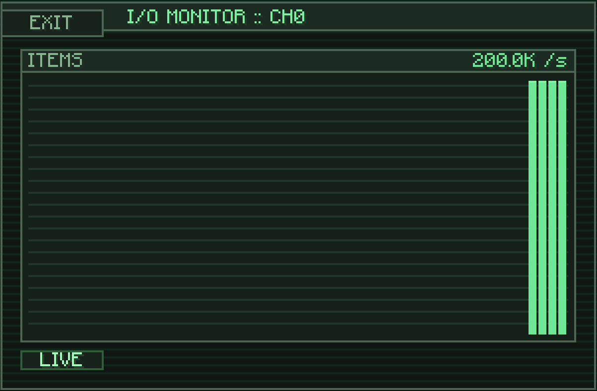

---
navigation:
  title: I/O Monitor
  parent: computer/index.md
  position: 2
---

# I/O Monitor

The live telemetry view for a mounted network. Shows every active channel across the whole network — aggregated by channel index — and lets you drill into each one for a throughput graph.

Open it from the mounted network's subsystem buttons. Hit **EXIT** in the top-left corner to return to the directory.

## Channel List

Each row shows one channel index that has at least one node on this network running something:

- **CH0** / **CH1** / ... — the channel index (0 through 8). Matches the channel-slot numbers on the node screen.
- **Type** — what the channel is moving: **Items**, **Fluids**, **Energy**, **Chemicals**, or **Source**. Colored to match the type.
- **Node count** — how many nodes on this network have this channel enabled.

The left edge of each row has a **colored bar** matching the channel type — green for items, blue for fluids, and so on. Handy for spotting the type at a glance without reading the right-hand text.

Aggregation is **per channel index**, not per node. If you have 10 nodes all running an Item transfer on CH0, the list shows one `CH0 Items 10 nodes` row, not 10 rows. Click the row to drill into the graph.

## Throughput Graph

Clicking a channel row opens its graph. The graph shows a **live timeline of transfer throughput** for that channel:

- **120 data points** total. Each bar is one sample; the rightmost bar is the newest.
- Updates roughly once per second as telemetry streams in.
- The scale adapts to the peak — the header shows the peak value (e.g. `200.0K /s`) with the unit appropriate for the type:
  - **Items** — items per second.
  - **Fluids** — millibuckets per second (`mB/s`).
  - **Energy** — Forge Energy / RF per second.
  - **Chemicals** — millibuckets per second.
  - **Source** — source per second.
- The **LIVE** indicator in the bottom-left lights up when new data is coming in.

## Reading The Graph

- Steady tall bars = constant throughput. Setup working hard.
- Empty graph = channel exists but no transfers are happening. Check filters, status, and whether the source block actually has the resource.
- Spiky pattern = bursty transfers. Usually delayed channels (high Delay) or intermittent producers.
- Sudden drop to zero = the channel stopped (source drained, Redstone turned it off, network unmounted from the node, etc.).

Hit **EXIT** on the graph page to return to the channel list.
