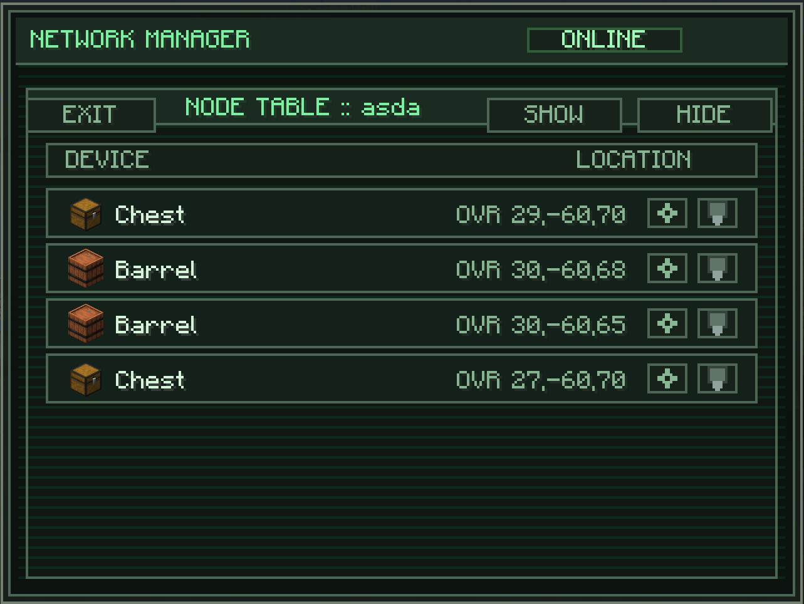
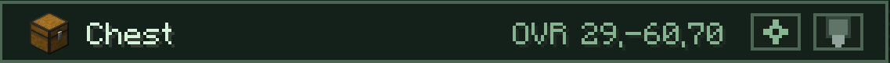

---
navigation:
  title: Node Table
  parent: computer/index.md
  position: 3
---

# Node Table

The per-node view for a mounted network. Lists every node that belongs to the network — with its block type, location, and a pair of action buttons for jumping to it in the world or remotely editing its config.

Open it from the subsystem buttons after mounting a network. Hit **EXIT** in the top-left to return.

## The Table

Each row shows one node on the network. Columns:

- **Device** — an item icon for the block the node is attached to, plus that block's display name (`Chest`, `Barrel`, `Furnace`, etc.).
- **Location** — the dimension and block coordinates. Dimension uses a short code (`OVR` = Overworld, `NTH` = Nether, `END` = End, custom dims show their own short code). Coords follow as `X, Y, Z`.
- **Actions** — two icon buttons on the right side of every row.

### Row Actions

- **Highlight** (the lamp icon) — toggles a glowing outline on the node in the world, making it easy to find. The outline stays on until you click the lamp again or close the Computer screen.
- **Settings** (the gear / terminal icon) — opens that node's full configuration screen **remotely**, from wherever you are. You do not have to go stand next to the node to edit its channels or filters.

## Label Grouping

Nodes with a label are grouped together under that label. The label name shows as a header row; click the header to collapse the whole group into one line, click it again to expand. Nodes without a label render flat at the bottom of the list.

Collapse state is remembered for the session — expand the groups you are working on and collapse the rest to keep the table readable on big networks.

Labels are set from the [Header → Set Label](../nodes/header.md) field on each node, or copied automatically when you paste with the [Wrench → Copy/Paste](../wrench/copy-paste.md).

## Bulk Show / Hide

Two buttons in the top-right corner of the Node Table:

- **SHOW** — turns **render visibility on** for every node on the mounted network. All nodes draw in the world at full opacity, whether you are holding a wrench or not.
- **HIDE** — turns render visibility **off** for every node on the mounted network. Nodes only draw while you hold a wrench, at reduced opacity.

For a refresher on what the Visible toggle does per node, see [Header → Visible](../nodes/header.md).

## Pagination

Seven rows fit per page. Scroll the mouse wheel to page through larger networks.

## Good to Know

- The Node Table is live. Nodes added, removed, or relabelled appear/disappear without having to reopen the Computer.
- Remote Settings open the full node screen you would see in the world — filters, upgrades, every channel. Changes are committed the same way as if you were standing in front of the node.
- Highlight outlines are client-side and only visible to you, not to other players on the server.
