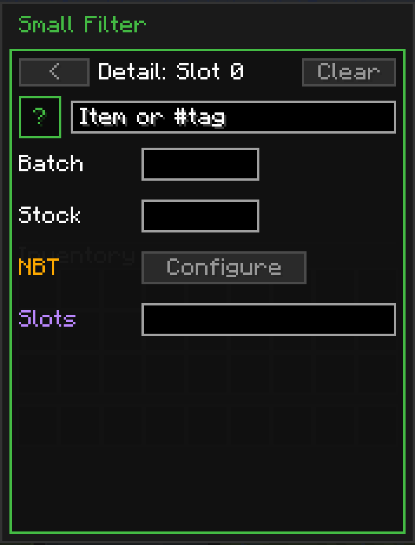
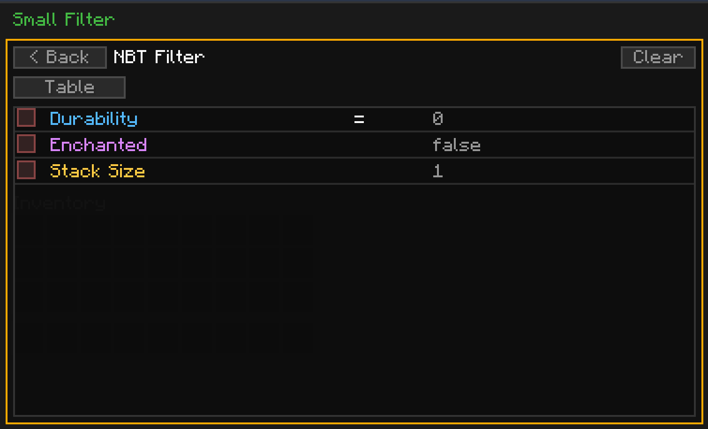

---
navigation:
  title: Advanced Filtering
  parent: filters/index.md
  position: 6
---

# Advanced Filtering

The Small, Medium, and Big filters all hold a 9/18/27-slot grid of entries. Dropping an item into a slot is the simplest way to use them. But every entry slot also has a hidden **Detail** page with per-entry options that make the filter do a lot more than match-by-exact-item.

This page covers that Detail page and its NBT sub-screen. The options apply the same way on Small, Medium, and Big — the only difference is how many entry slots you get to use them on.

## Opening The Detail Page

Open the filter in-hand (right-click), then **ctrl + left-click a filled entry slot** in the main grid. The view swaps to the Detail page for that slot.

From here you can set all the per-entry options described below. The `< Back` button at the top returns you to the main grid. The `Clear` button at the top-right wipes every field on this entry and sends you back.

## Item or #tag

The top field controls **what the entry matches**. Two formats:

- **Exact item id** — e.g. `minecraft:iron_ingot`. Matches only that item.
- **Tag** — prefix with `#`, e.g. `#c:ores` or `#minecraft:planks`. Matches **every** item that belongs to the tag.

You do not have to use both — you can leave the field blank and use only NBT rules, or use only Slots. An entry with no item/tag but NBT rules active will match any item that satisfies the NBT conditions.

The small `?` button to the left of the field pops a help tooltip reminding you of the accepted formats.

**Sender** — only items matching the id/tag are pulled out of the source block.
**Receiver** — only items matching the id/tag are accepted into the destination block. Anything else passing through the network is ignored by this entry.

## Batch

A per-entry override for how many items this entry moves per transfer. This is **not additive** with the channel's Batch setting — it caps only transfers of this specific entry.

- Leave it `0` (blank) to fall back to the channel's Batch.
- Set it to a positive number to cap transfers of this entry to that amount per operation.

Use case: the channel-wide Batch is 64, but you want iron nuggets throttled to 16 per op. Put iron nuggets in a slot, open Detail, set Batch to 16. Other entries on the same channel still honour the channel-wide 64.

**Sender** — caps how many of this entry get pulled out of the source block per transfer operation.
**Receiver** — ignored. The Sender decides the batch size; receivers do not throttle throughput. Set Batch only on the Sender side to control flow.

## Stock

Amount threshold for the entry. This is the one field whose meaning is **different** on Senders and Receivers:

- **Sender (exporter)** — Stock is a **reserve**. Never pull this entry out of the source block if doing so would leave fewer than the stock value behind. Example: set Stock to `8` on a coal entry — the Sender will leave at least 8 coal in the source chest at all times.
- **Receiver (importer)** — Stock is a **cap**. Stop inserting this entry into the destination block once the destination already holds at least the stock value. Example: set Stock to `64` on an iron-ingot entry — the Receiver will stop topping up the destination once it has 64 iron ingots.

Leave it `0` (blank) to disable the threshold entirely. Great for keeping fuel in a furnace without over-stuffing it, or keeping a buffer of seeds in a farm chest without letting everything get siphoned out.

## NBT Rules

Click **Configure** to open a sub-page for adding NBT rules to this entry. Rules let you match items by their component data (enchantments, damage, custom name, stack size, custom NBT tags, and so on) on top of the item/tag match.

The sub-page has two modes:

- **Table** (default) — click rows to build typed rules: Durability, Enchanted, Stack Size, and any custom NBT path you care to type in. Each rule has an operator (`=` equals, `!=` not-equals) and a value. Up to **6 rules per entry**.
- **Raw SNBT** — a text field where you paste a raw SNBT snippet. The entry matches if the item's NBT contains every tag in your snippet. Advanced use only — good for patterns the table cannot express cleanly.

Each rule has a checkbox on the left — check it to make the rule active. Unchecked rules are ignored. The `Clear` button at the top wipes every NBT rule on this entry and brings you back to the Detail page. `< Back` returns without clearing.

### Common NBT Rule Examples

- **Only damaged tools** — add rule `Durability` `!=` `0`. Matches only tools that have lost some durability.
- **Only enchanted books** — add rule `Enchanted` `=` `true`. Matches only items with at least one enchantment.
- **Non-stacked items only** — add rule `Stack Size` `=` `1`. Useful for routing single damaged tools without sending fresh stacks.

**Sender** — only items whose NBT satisfies the active rules are pulled out of the source block.
**Receiver** — only items whose NBT satisfies the active rules are accepted into the destination block. Incoming items that fail the rules keep flowing through the network and may be claimed by another Receiver.

## Slots

Restricts which **slot indices** on the attached block this entry reads/writes. Useful for side-aware machines and multi-slot inventories where you want one channel to target specific slots only.

Format: a comma-separated list of slot indices and/or ranges. Examples:

- `0-8` — slots 0 through 8 inclusive.
- `0,3,5` — only slots 0, 3, and 5.
- `0-3, 5` — slots 0 through 3, plus slot 5.

Valid slot indices run from **0 to 53** (standard Minecraft inventories top out around there). Leave the field blank to let the entry use every slot the block exposes.

Use case: a furnace has slot 0 (input), slot 1 (fuel), slot 2 (output). Put coal in one entry with Slots `1` to make sure coal only goes in the fuel slot. Put smeltables in another entry with Slots `0` to keep them out of the fuel slot.

**Sender** — restricts which slots on the **source** block the channel extracts from. Only those slots are read.
**Receiver** — restricts which slots on the **destination** block the channel inserts into. Only those slots are written. Example: set Slots `0` on a furnace Receiver to force smeltables into the input slot even if the fuel slot happens to be empty and would otherwise accept the stack.

## Clearing

- **Clear on the Detail page** — wipes everything on this entry: item/tag, Batch, Stock, Slots, and all NBT rules.
- **Clear on the NBT sub-page** — wipes just the NBT rules; item/tag, Batch, Stock, and Slots stay untouched.

## Takeaway

Every slot in a [Small](small.md), [Medium](medium.md), or [Big](big.md) filter's main grid is more than a single-item checkmark. Open the Detail page and you can turn one slot into a precise rule: match by tag, override the batch, reserve a buffer, gate on enchantments, target specific inventory slots — all on a per-entry basis and without needing separate filter items.
