---
navigation:
  title: Channel Settings
  parent: nodes/index.md
  position: 2
---

# Channel Settings

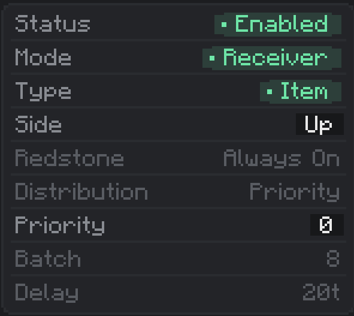

This panel controls the channel you have currently selected in the [Header](header.md). Every node has 9 channels and each one has its own independent copy of all the settings below — changing a setting here only affects the one channel you are looking at.

**Alt + Left/Right Click to set maximum or minimum amount for settings.**

Click the channel number buttons at the top of the screen to switch which channel these settings apply to.

## Status

**What it is:** on/off switch for the channel.

**What it does:**

- **Enabled** — the channel is live. It gets processed every tick (subject to Delay, Redstone, and so on).
- **Disabled** — the channel is completely skipped by the transfer engine. No extraction, no insertion, no redstone check. Nothing.

**How to change it:** left-click the value pill to toggle between Enabled and Disabled.

**Gotcha:** a disabled channel keeps all its other settings (filters, batch, delay, etc.). You are not deleting anything — you are just pausing it. Re-enable to pick up right where you left off.

## Mode

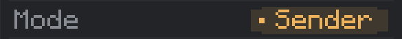

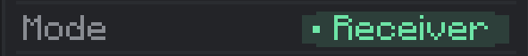

**What it is:** the direction of this channel's transfer.

**What it does:**

- **Sender** — pulls resources **out of** the block this node is attached to. Senders are the ones that drive transfers: they look for matching Receivers on the same channel number across the network and push resources to them.
- **Receiver** — accepts resources **into** the block this node is attached to. Receivers are passive — they wait for a Sender on the same channel number to deliver.

**How to change it:** left-click the value pill to flip between Sender and Receiver.

**Gotcha:** a network with only Receivers (or only Senders) does nothing. You need at least one of each on the same channel number for anything to move.

## Type

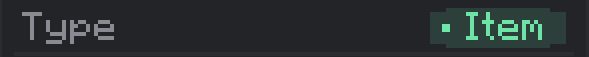

**What it is:** the kind of resource this channel moves.

**What it does:** tells the engine which capability to look for on the attached block:

- **Item** — stacks of items from an inventory (chests, furnaces, hoppers, AE2 interfaces, etc.).
- **Fluid** — millibuckets (mB) from a tank.
- **Energy** — Forge Energy / RF from an energy buffer.

**How to change it:** left-click the value pill to cycle through the available types.

**Gotcha:** not every block supports every type. If the block has no matching capability on the chosen side, the channel will silently do nothing. Put an item node on a fluid tank and it won't transfer — because the tank has no item inventory.

Two extra types — Chemical (Mekanism) and Source (Ars Nouveau) — exist but require specific upgrades to unlock. They are covered on the Upgrades page.

## Side

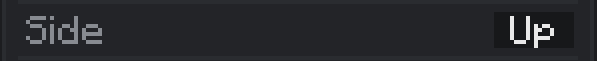

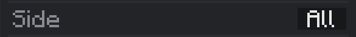

**What it is:** which face of the attached block this channel interacts with.

**What it does:** some blocks behave differently depending on which side you insert to or extract from. Furnaces are the classic example: top side takes fuel, front side takes/gives the smelted item, bottom side only gives output. Side lets you pick exactly which face to use.

- **Up / Down / North / East / South / West** — only that one face. The engine probes the block's inventory (or tank, or energy buffer) on that specific side and uses whatever slots the block exposes there.
- **All** — every face of the block is merged into one combined handler. The channel sees the block as a single pool of slots/tanks/buffers made up of every side's exposed storage. If two faces expose the exact same handler (common — most blocks expose one inventory on every side), the duplicate is removed so you do not double-count.

**How to change it:** left-click to cycle to the next face (order goes Up → Down → N → E → S → W → All → Up ...).

**Gotcha:** on blocks with side-aware inventories (furnaces, brewing stands, some machines), each face exposes a *different* set of slots. Picking **All** on a furnace lets the channel see the input, fuel, and output slots all at once, which is usually not what you want. Pick the specific face so filters only apply to the slots you care about.

## Redstone

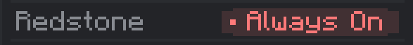

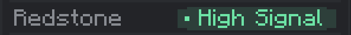

**What it is:** redstone control for this channel.

**What it does:** the engine checks the redstone signal **at the block this node is attached to** (from any neighbor — lever, redstone torch, dust, comparator, whatever). Based on that signal, the channel either runs or is blocked:

- **Always On** — run regardless of signal.
- **Always Off** — never run. Same effect as Status = Disabled, but you keep the channel armed.
- **High Signal** — run only when a redstone signal is present (strength > 0).
- **Low Signal** — run only when there is no redstone signal (strength = 0).

**How to change it:** left-click to cycle to the next mode.

**Disabled on Receivers:** this row is greyed out when Mode is Receiver. Redstone gating only applies on the Sender side (since Senders drive the transfer).

## Distribution

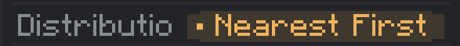

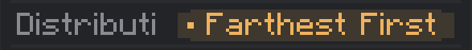

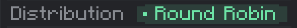

**What it is:** how a Sender picks between multiple matching Receivers on the same channel number.

**What it does:** when there is only one Receiver, this setting does nothing. When there are several, it decides the order they are served in:

- **Priority** — sort by each Receiver's **Priority** value. Higher numbers are served first. Ties are broken in no particular order.
- **Nearest First** — serve the Receivers closest to the Sender first (by straight-line distance).
- **Farthest First** — opposite of Nearest First: serve the furthest Receiver first.
- **Round Robin** — rotate through Receivers evenly. Each successful transfer advances the rotation pointer to the next Receiver.

**How to change it:** left-click to cycle to the next mode.

**Gotcha:** Round Robin's rotation pointer **persists across ticks**. It does not reset between game ticks — it just keeps advancing. This gives you a genuinely fair rotation across long runtimes, not a re-started loop every tick.

**Disabled on Receivers:** this row is greyed out when Mode is Receiver. Distribution only makes sense on the Sender side.

## Priority

**What it is:** a small integer attached to this channel. Range: **–99 to +99**.

**What it does:** used by a Sender that has Distribution set to **Priority**. The Sender sorts its target Receivers by this number, highest first, and serves them in that order. Receivers with higher priority get resources before lower-priority ones.

**How to change it:** left-click the number field to open a text box, type a number between –99 and 99, and press Enter.

**Gotcha:** Priority is only consulted when Distribution = Priority. Under Nearest/Farthest/Round Robin it is ignored — the sorter never reads it. Set Priority on the **Receivers** you want served first, not on the Sender.

## Batch

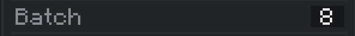

**What it is:** the maximum amount of resource moved in one transfer operation.

**What it does:** caps a single transfer attempt. Units depend on Type:

- **Item** — number of items (e.g. Batch 64 = up to one full stack per operation).
- **Fluid** — millibuckets (e.g. Batch 1000 = up to 1 bucket per operation).
- **Energy** — Forge Energy / RF per operation.

**How to change it:** left-click the number field to open a text box, type the new value, and press Enter. Minimum is 1.

**Gotcha:** Batch is capped by the upgrades installed on the node. You can type 10,000 but if your upgrade tier only allows 500, the engine uses 500. Install higher-tier upgrades to raise the ceiling — see [Performance Upgrades](upgrades-performance.md).

**Disabled on Receivers:** this row is greyed out when Mode is Receiver. Batch size is decided by the Sender.

## Delay

**What it is:** cooldown between transfer operations on this channel, measured in **ticks**. `20t` means 20 ticks, which is 1 second of real time.

**What it does:** after a successful transfer the channel waits this many ticks before trying again. Used to throttle channels so they do not spam-transfer every tick when you do not need them to.

**How to change it:** left-click the number field to open a text box, type the new value, and press Enter. Minimum is 1 tick.

**Gotcha:** Energy channels **ignore Delay**. The engine forces Energy transfers to 1-tick (instant) regardless of what you put here. The Delay row is greyed out on Energy-type channels for that reason.

**Gotcha (upgrades):** Delay is also clamped by your upgrade tier's minimum delay. You can type 1, but if your upgrades only allow 10, the engine uses 10. Better upgrades mean a lower floor.

**Disabled on Receivers:** this row is greyed out when Mode is Receiver. The Sender decides how fast it pushes.

---

Every row on this page lives on the currently selected channel only. Switch channels in the [Header](header.md), or set up shared filters and upgrades on [Filters & Upgrades](filters-upgrades.md).
