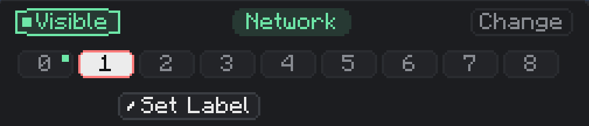
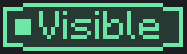
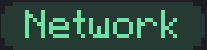
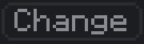
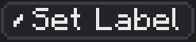

---
navigation:
  title: Header
  parent: nodes/index.md
  position: 1
---

# Header

The header is the top row of the node configuration screen. It handles three jobs: how the node is rendered in the world, which network the node belongs to, and which of the 9 channels you are currently editing.

## Visible

**What it is:** a toggle that controls how the node renders in the world.

**What it does:**

- **Visible** (the default): the node renders **always**, at full opacity, whether or not you are holding a wrench.
- **Hidden**: the node does **not** render normally. It only appears when you hold a wrench, and while shown that way it is drawn at about one-third opacity so you can still see and click it.

Visibility is cosmetic only. Hidden nodes still transfer resources exactly the same as visible ones.

**How to change it:** left-click the button. The text flips between **Visible** and **Hidden** and the change takes effect instantly. You can also bulk-toggle every node on a network using the **SHOW** / **HIDE** buttons in the Computer's Node Table.

Use Hidden once a setup is finished to clean up the view, then pull out a wrench when you need to find the nodes again.

## Network

**What it is:** the green pill in the middle of the header. It shows the name of the network this node is currently attached to.

**What it does:** displays the current network name. The default name for a freshly created network is literally **Network**, so a pill that reads "Network" means you are on a default-named network. Any other text means the network has been renamed.

**How to change it:** the pill itself is a label, not a button. To move the node to a different network, use the **Change** button next to it.

A node that is not assigned to a network does nothing — all 9 channels stay inactive until you pick a network.

## Change

**What it is:** the button to the right of the Network pill.

**What it does:** opens the network picker screen. From there you can:

- Pick an existing network you own and move the node onto it.
- Type a new name (up to 32 characters) to create a fresh network and join it.
- Leave the current network so the node becomes unassigned.

**How to change networks:** click **Change**, then either select a listed network or type a new name and confirm. The node moves immediately and the main screen returns to the channel configuration view.

Use this to split a setup into separate networks, merge several nodes onto one shared network, or rename the network the node is on.

## Channel Selector

**What it is:** the row of nine buttons numbered **0** through **8**. These are the node's 9 channels.

**What it does:** picks which channel is currently open in the settings panel below. Everything under the header — Status, Mode, Type, Filters, Upgrades — only applies to the channel you have selected here.

**Indicators:**

- **Red outline** around a number = that channel is currently selected (you are editing it).
- **Green dot** next to a number = that channel's Status is not Disabled (it is enabled and running).
- No outline and no dot = the channel exists but is disabled and not selected.

All 9 channels run at the same time once enabled. The selector is only about which one you are *looking at*, not which one is *active*.

**How to change channels:**

- **Single click** a channel number to select it. Settings below swap to that channel's config.
- **Double click** a channel number that is already selected to rename it. A text box appears where you can type a custom name (up to 24 characters). Press Enter to save, click outside to cancel.

**Channel naming:** each channel can be given its own short name, independent of the node's label. The name shows up only when you hover the channel button — a tooltip pops up with the channel's name. If no name is set, the tooltip prompts you to double-click to set one.

Names are purely cosmetic — they do not affect transfers. Use them to tag channels by purpose, for example `in`, `out`, `fuel`, `buffer`, or `overflow`, so you can remember what each channel does when you come back to the node later.

## Set Label

**What it is:** the button below the channel selector row.

**What it does:** assigns a text label to the whole node. Labels are separate from both the network name and channel names — they are a way to group identical nodes so their channel settings stay in sync.

**How to change it:** click **Set Label**. A text box opens with a dropdown of all labels already in use on this network. Either:

- Pick an existing label from the dropdown to join that group.
- Type a new label (up to 48 characters) and press Enter to create a fresh group.

Leave the field empty and confirm to clear the label.

**Why it matters:** when two or more nodes on the same network share the same label, any change to one of them is automatically copied to every other node in the group. This covers channel modes, types, filters, batch sizes, delays, filter items, and filter configurations. Upgrades stay per-node, and batch sizes are clamped to what each node's upgrades allow.

Typical use: label all 20 of your furnace nodes `furnace`, configure one, and the other 19 copy the setup automatically. Later tweaks to any of them propagate to all.

Labels also drive the Computer's Node Table, where nodes are grouped by label for easier browsing.
