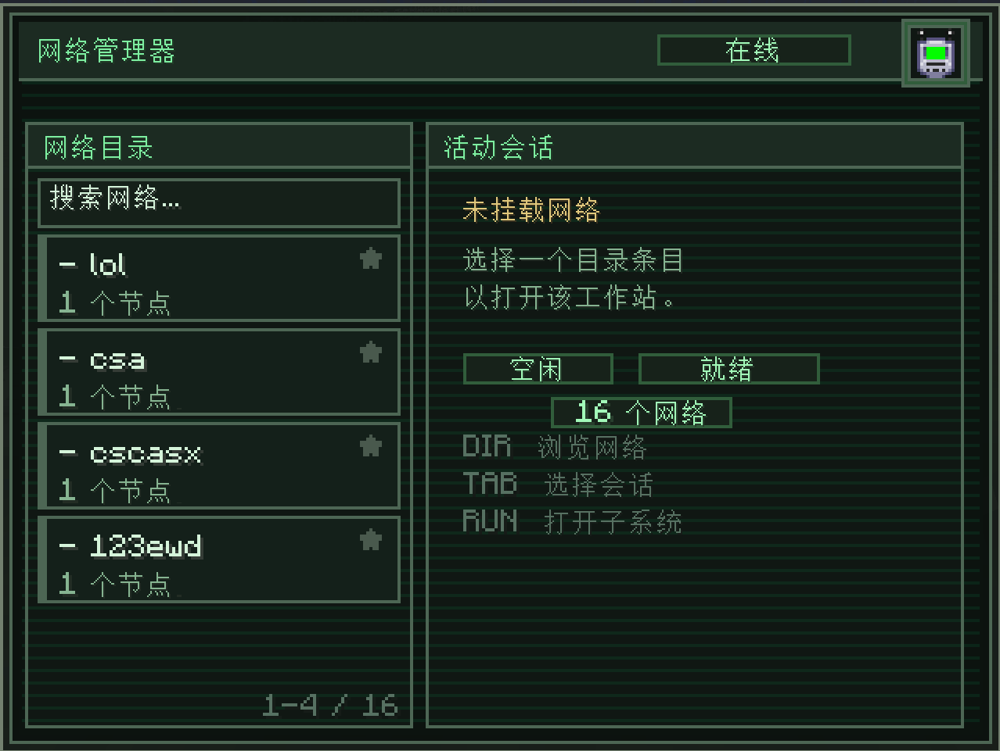

# 电脑

电脑是可放置的方块，也是监控和管理物流网络的终端接口。往基地里放一台，右击，就能打开一整块仪表盘：列出所有网络，查看所有活动频道的实时吞吐量，直接编辑任意节点的配置，还能批量切换节点的可见性。

## 打开电脑

右击放置下来的电脑方块可打开**网络管理器**界面。只要物品栏内任意一处有[扳手](../wrench/index.md)，电脑即会**自动加载**出一份副本，并置入右上角的磁盘槽。扳手只会被复制，不会被消耗——关闭界面后扳手会留在电脑中，直至手动取回。

磁盘槽只在网络管理器界面下可用。切换至I/O监视器或节点表视图后，该槽位和其中扳手便不再可见，直至退出到管理器界面才会恢复。

## 三个子系统

在网络目录中选中网络后，即可前往两个子系统中的一个。详情见对应章节：

- [网络目录](network-directory.md)：左侧的网络列表，可供搜索、置顶、挂载网络。
- [I/O监视器](io-monitor.md)：频道吞吐量的汇总数据，配有实时图标（每频道120个采样点）。
- [节点表](node-table.md)：所挂载网络的所有节点，按标签分组，可按行执行操作。

电脑还能[存储和加载网络](save-load.md)——将整个网络中节点的设置保存到磁盘中的`.lnet`文件，后续可以重新加载到扳手中。

在挂载网络前，右侧界面只会显示**未挂载网络**。可从目录中挑选一个进行挂载，而后子系统按钮即会解锁。

## 标星网络

目录中各网络条目的右侧都有一个小型**星星**图标。点击该图标可将网络置顶。置顶（标星）的网络会在排序中居于首位，未置顶的网络必然在置顶网络的下方。标星状态信息存储于电脑方块本身——每次会话间保留，不同电脑的状态可不同（两台电脑的置顶设置可以不同）。

网络**不会仅限所有者访问**。服务端中的每一台电脑都能看见该服务端的所有网络，不受放置者限制。

## 合成配方

<RecipeFor id="logisticsnetworks:computer" />
