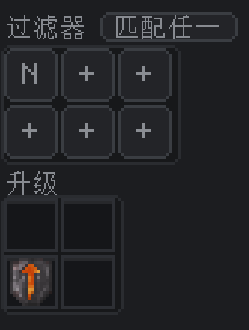
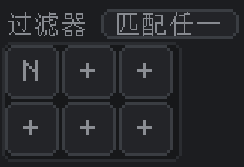
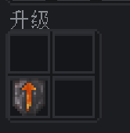
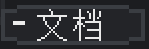
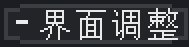

---
navigation:
  title: 过滤器与升级
  parent: nodes/index.md
  position: 3
---

# 过滤器与升级

节点配置的右侧面板有四个组件：3x2的过滤器槽，2x2的升级槽，**文档**按钮和**界面调整**按钮。详情见下。

## 过滤器

**它是什么：**&zwnj;由6个虚拟过滤器按钮组成的3x2方格，外加方格上方的切换按钮（**匹配任一**或**匹配全部**）。空按钮显示为&zwnj;**+**；经过配置的则按类型显示——**N**（普通）、**Mo**（模组）、**Rx**（正则表达式）。

**它的功能：**&zwnj;过滤器按钮指定了该频道可移动的资源。

- **左击空按钮**可打开一个小型选框，可在其中选择类型——**普通**、**模组**、**正则表达式**。此操作会创建过滤器并打开其配置。
- **左击经配置的按钮**可编辑该过滤器。
- **右击经配置的按钮**可移除该过滤器（槽位变回&zwnj;**+**&zwnj;）。
- **往按钮拖放物品**（拿起物品后左击）可将物品本身加入过滤器。

过滤器**按频道设置，不按节点**。过滤器槽仅属于**单个频道**——[标题](header.md)中选择的频道。切换到其他频道后，过滤器槽会改为展示该频道的过滤器。也即，各频道都有独属于它们的6个过滤器槽，单个节点可接受9套过滤器配置。

**可用的过滤器类型：**

- 按钮挑选器可创建**普通**、**模组**、**正则表达式**过滤器。普通过滤器中可配置物品、流体、化学品、标签、NBT、耐久度、已附魔与否、槽位、单次数量、库存量规则，并调整其容量。
- 有关各类过滤器及其配置方法的详细信息，参见[过滤器](../filters/index.md)。

**空槽位 = 传输所有。**&zwnj;若6个槽位均为空，则频道会传输所有匹配的资源（受类型影响，物品频道显然只会传输物品）。过滤器只是可选的限制，而非必须的组件。

### 匹配任一/匹配全部按钮

点击过滤器方格上方的按钮可在两种匹配模式间切换：

- **匹配任一**（默认）：只要匹配**至少一个**过滤器，即允许传输。过滤器此时类似于判定列表；只要有一个通过就可以了。
- **匹配全部**：仅在匹配**全部**过滤器时允许传输。过滤器此时类似于叠加条件，要求所有判断条件都为真。

**简单示例：**&zwnj;比如说，你在某个频道的过滤器槽里放入了设为`c:ores`的**标签过滤器**，以及设为“在箱子中保留64个”的**数量过滤器**。

- **匹配任一**：频道会传输所有带`c:ores`标签的资源，**或者**所有数量过滤器允许传输的资源。两者都会触发。
- **匹配全部**：频道只会传输**既**带`c:ores`标签**也**通过数量过滤器判断的资源。

**如何改动：**&zwnj;左击按钮可在匹配任一和匹配全部间切换。改动立即生效于当前频道。

## 升级

**它是什么：**&zwnj;由4个升级槽组成的2x2方格。

**它的功能：**&zwnj;此处安装的升级物品作用于整个节点——它们能增加单次运输上限，减少最小延迟刻数，还能解锁特殊能力（如化学品和魔源类型）。

升级**按节点设置，不按频道**，与过滤器正好相反。节点的**所有9个频道**共享升级。放入一个钻石级升级，则所有频道都将获得更大的单次数量和更短的延迟，无需（也无法）单独为频道安装升级。

**槽位接受什么物品：**

- 仅接受升级物品（铁级、金级、钻石级、下界合金级、跨维度、通用机械化学品、新生魔艺魔源）。不接受普通物品。
- 有关升级性能和功能的详细信息，参见[性能升级](upgrades-performance.md)和[特种升级](upgrades-special.md)。

**不可重复安装。**&zwnj;同一节点内不可安装两个同种升级。槽位会拒绝已有的升级。可以混用以叠加效果，如使用一个钻石级、一个跨维度、一个通用机械化学品、一个新生魔艺魔源。

**如何安装：**&zwnj;将升级物品左击放入空槽位，或在物品栏中Shift点击。再次左击（或Shift点击）以移除。

## 文档

**它是什么：**&zwnj;面板左下角的按钮。

**它的功能：**&zwnj;打开物流网络指南，也就是你现在正在读的这本书。若是在编辑中途遇到问题，又不想退出到物品栏去找书，就可以使用这个按钮。

**如何使用：**&zwnj;左击可打开指南。关闭指南会返回到节点界面。

## 界面调整

**它是什么：**&zwnj;面板右下角的按钮。

**它的功能：**&zwnj;打开一个小对话框，可在其中选择界面主题。主题会更改节点UI的颜色——过滤器、升级、标题、频道设置均会遵从主题的配色。

**如何使用：**&zwnj;左击可打开对话框。点击任意选色卡即可应用对应主题。点击角落的×按钮，或点击对话框外部，均可关闭对话框。主题保存于客户端，且在不同会话间保持不变。

界面调整只是视觉效果。主题不会影响传输、过滤器、升级。
