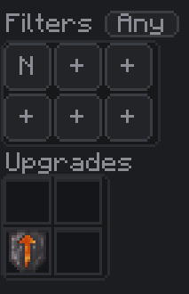
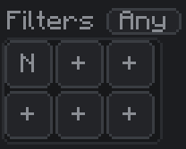
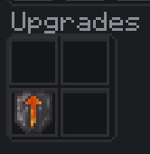
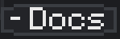
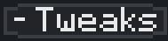

---
navigation:
  title: Filters & Upgrades
  parent: nodes/index.md
  position: 3
---

# Filters & Upgrades

The right-hand panel of the node configuration screen holds four things: a 3x2 grid of filter slots, a 2x2 grid of upgrade slots, a **Docs** button, and a **Tweaks** button. Each one is covered below.

## Filters

**What it is:** a 3x2 grid of 6 virtual filter buttons plus a toggle button (labelled **Any** or **All**) above the grid. An empty button shows a **+**; a configured one shows its type — **N** (Normal), **Mo** (Mod), or **Rx** (Regex).

**What it does:** the filter buttons decide which resources this channel is allowed to move.

- **Left-click an empty button** to open a small picker and choose a type — **Normal**, **Mod**, or **Regex**. The filter is created and its configuration opens.
- **Left-click a configured button** to edit that filter.
- **Right-click a configured button** to remove it (the slot goes back to **+**).
- **Drop an item onto a button** (carry it and left-click) to add that item straight into the filter.

**Per-channel, not per-node.** The filter slots belong to **one channel at a time** — whichever channel is selected in the [Header](header.md). Switch to a different channel number and the 6 slots re-fill with that channel's filters. This means every channel has its own independent set of 6 filter slots, so a single node can run 6 completely different filter configurations.

**Available filter types:**

- The button picker creates **Normal**, **Mod**, or **Regex** filters. Inside a Normal filter you configure item, fluid, chemical, tag, NBT, durability, enchanted, slot, batch, and stock rules, and adjust its capacity.
- For detail on each filter type and how to configure them, see [Filters](../filters/index.md).

**Empty slots = pass everything.** If all 6 slots are empty, the channel transfers any matching resource (subject to Type — an Item channel still only moves items, obviously). Filters are an optional narrowing, not a requirement.

### The Any / All button

Click the button above the filter grid to toggle between the two match modes:

- **Match Any** (default) — a resource is allowed if it passes **at least one** filter. Filters work like a checklist of acceptable items; any filter that says "yes" is enough.
- **Match All** — a resource is allowed only if it passes **every** filter in the grid. Filters work like a stack of conditions that all have to be true at once.

**Quick example:** suppose you put a **Tag Filter** set to `c:ores` and an **Amount Filter** set to "keep 64 in the chest" in the same channel's grid.

- **Match Any**: the channel will move anything tagged `c:ores`, **or** anything the Amount Filter allows. Either rule triggers.
- **Match All**: the channel will only move items that are **both** tagged `c:ores` **and** pass the Amount Filter's threshold.

**How to change it:** left-click the button to flip between Any and All. The change takes effect instantly for the current channel.

## Upgrades

**What it is:** a 2x2 grid of 4 upgrade slots.

**What it does:** upgrade items installed here affect the whole node — they increase the batch caps, lower the minimum tick delay, and unlock special capabilities (like the Chemical and Source channel types).

**Per-node, not per-channel.** This is the opposite of Filters. Upgrades are shared by **all 9 channels** on the node. Insert a Diamond Upgrade and every channel on the node benefits from the higher batch cap and shorter delay. You do not need to (and cannot) install separate upgrades for each channel.

**What fits in the slots:**

- Only upgrade items (Iron / Gold / Diamond / Netherite / Dimensional / Mekanism Chemical / Ars Source). Regular items are rejected.
- For detail on each upgrade and what it unlocks, see [Performance Upgrades](upgrades-performance.md) and [Special Upgrades](upgrades-special.md).

**No duplicates.** You cannot install two of the same upgrade in one node. The slot refuses any upgrade that is already present in the other slots. Mix and match — one Diamond, one Dimensional, one Mekanism Chemical, one Ars Source — to stack different effects.

**How to install:** left-click an upgrade item into an empty slot, or shift-click from your inventory. Left-click again (or shift-click out) to remove.

## Docs

**What it is:** the button at the bottom-left of the panel.

**What it does:** opens the Logistics Networks guidebook — the very book you are reading right now. Useful as a shortcut if you have a question mid-setup and do not want to close the node screen and find the book in your inventory.

**How to use it:** left-click. The book opens. Close it to return to the node screen.

## Tweaks

**What it is:** the button at the bottom-right of the panel.

**What it does:** opens a small dialog with theme swatches. Themes recolor the node screen UI — Filters, Upgrades, Header, and Channel Settings all follow the selected theme.

**How to use it:** left-click to open the dialog. Click any swatch to apply that theme. Close the dialog with the × button in the corner or by clicking outside it. The theme choice is client-side and sticks across sessions.

Tweaks is purely cosmetic — the theme has no effect on transfers, filters, or upgrades.
