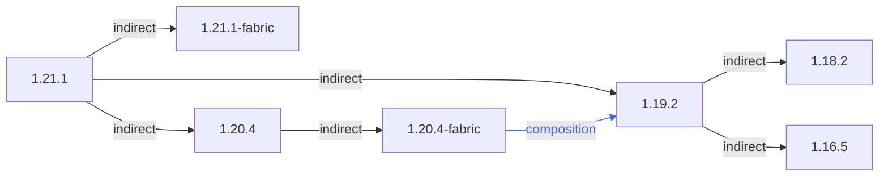

### 总概



```
1.21.1
 ├── 1.21.1-fabric
 ├── 1.20.4
 │    └── 1.20.4-fabric (composition)
 └── 1.19.2 (composition)
      ├── 1.18.2
      └── 1.16.5
```

### 链接区域

- [1.16.5](/projects/assets/macaws-bridges-biome-o-plenty/1.16/macawsbridgesbop)
- [1.18.2](/projects/assets/macaws-bridges-biome-o-plenty/1.18/macawsbridgesbop)
- [1.19.2](/projects/assets/macaws-bridges-biome-o-plenty/1.19/macawsbridgesbop)
- [1.20.4](/projects/assets/macaws-bridges-biome-o-plenty/1.20/macawsbridgesbop)
- [1.21.1](/projects/assets/macaws-bridges-biome-o-plenty/1.21/macawsbridgesbop)
- [1.20.4-fabric](/projects/assets/macaws-bridges-biome-o-plenty/1.20-fabric/macawsbridgesbop)
- [1.21.1-fabric](/projects/assets/macaws-bridges-biome-o-plenty/1.21-fabric/macawsbridgesbop)